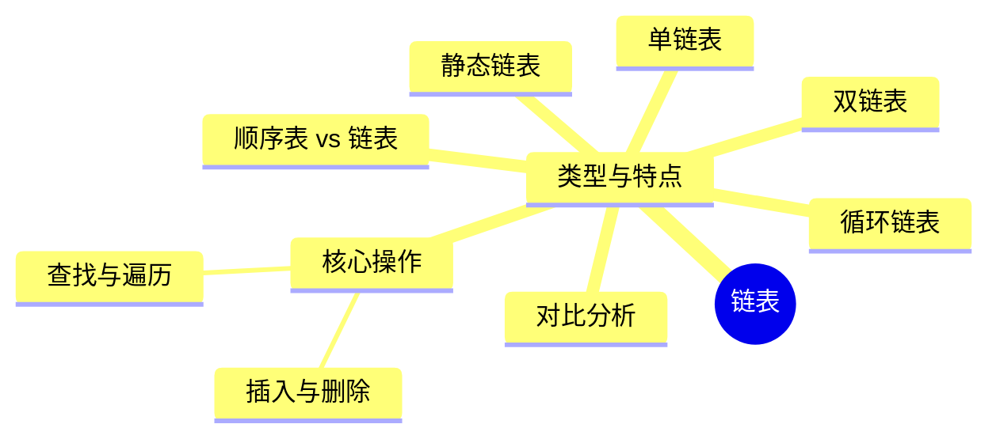

# 02 线性表
## 02-1线性表的定义和基本操作
![[第二章 2.1线性表的定义和基本操作 2025-04-19 22.26.32.excalidraw]]

---
### 1 线性表的定义
- **定义**：
  线性表是 **n (n≥0)** 个 **相同数据类型** 的**数据元素**的 **有限序列**，表示为：
$$
  L = (a_1, a_2, \dots, a_i, a_{i+1}, \dots, a_n)
  $$  
  - **表长**：n（n=0 时为空表）
  - **位序**：$a_i$是第 i 个元素（**从 1 开始**，与数组下标不同）

> [!tip]  线性表的逻辑特性如下：
> - **唯一前驱/后继**（除头尾元素外）
> 除第一个元素外，每个元素**有且仅有一个直接前驱**；
> 除最后一个元素外，每个元素**有且仅有一个直接后继**。

- **数据元素同构**（占相同内存空间）

| 🔑 **关键辨析**                 |
| --------------------------- |
| ❌ 所有整数按递增排列 **不是线性表**（无限序列） |

---
### 2 线性表的基本操作

| **操作类型** | **函数名**               | **功能描述**       | **参数说明**                 |
| -------- | --------------------- | -------------- | ------------------------ |
| **创销**   | `InitList(&L)`        | 初始化空表，分配内存     | `&L`：需修改线性表本身            |
|          | `DestroyList(&L)`     | 销毁表，释放内存       | `&L`：需释放原内存              |
| **增删**   | `ListInsert(&L,i,e)`  | 在第 i 位插入元素 e   | `i`：位序（1≤i≤n+1），`e`：插入元素 |
|          | `ListDelete(&L,i,&e)` | 删除第 i 位元素，返回 e | `&e`：需返回删除值              |
| **查找**   | `LocateElem(L,e)`     | 按值查找元素位置       | 返回元素位序或地址                |
|          | `GetElem(L,i)`        | 按位查找元素值        | `i`：位序（1≤i≤n）            |
| **辅助**   | `Length(L)`           | 返回表长           |                          |
|          | `PrintList(L)`        | 顺序输出所有元素       |                          |
|          | `Empty(L)`            | 判断是否为空表        | 若L为空表，则返回true，否则返回false。 |

---

###  **参数传递关键点**

```c  
void example(int x) {  
    x = 5;    // 修改副本，不影响原值  
}  

void example_ref(int &x) {  
    x = 5;    // 修改原变量  
}  
```  

- **何时用 `&`**：
  当需要 **修改参数本身** 并带回结果时（如 `InitList(&L)`、`ListDelete(&L,i,&e)`）。

---
## 02-2 线性表的顺序表示 #必考
### 1 顺序表的定义(线性表的顺序存储)
- **顺序表**——是用一组地址连续的存储单元依次存储线性表的数据元素，从而使得逻辑上相邻的两个元素在物理位置上也相邻
- **顺序存储**：
  将逻辑上相邻的元素存储在物理位置相邻的存储单元中，通过存储位置的邻接关系体现元素间的逻辑关系。
$$
  \text{地址计算公式：} LOC(a_i) = LOC(L) + (i-1) \times \text{sizeof(ElemType)}
$$
	**线性表的初始位置(基地址)**：$LOC(a_i)$是线性表的第一个数据元素$a_i$ 的存储位置
- **核心特点**：
  ✅ **随机访问**：通过首地址和元素序号可在$O(1)$ 时间内定位元素
  ✅ **存储密度高**：仅存储数据元素，无额外空间开销
  ❌ **容量固定**：静态分配不可扩展，动态分配扩展耗时
---
###  2 顺序表的基本操作
#### 1. 顺序表的初始化
	静态分配 vs 动态分配

| **特性**   | **静态分配**             | **动态分配**                 |
| -------- | -------------------- | ------------------------ |
| **定义方式** | 固定长度数组               | 指针指向动态分配内存               |
| **代码示例** | `#define MaxSize 10` | `ElemType *data;`        |
| **容量调整** | 不可扩展                 | 可重新分配内存（`malloc`/`free`） |
| **适用场景** | 数据量固定                | 数据量变化较大                  |
**静态分配：**

```c
#define MaxSize 10  //定义最大长度 
typedef struct{ 
	ElemType data[MaxSize]; //用静态的“数组”存放数据元素 
	int length; //顺序表的当前长度 
}SqList; //顺序表的类型定义（静态分配方式）
```

![[考研学习笔记01-数据结构 02 线性表 2025-10-21 3134.png|421x366]]

**动态分配代码示例**：

```c  
#define InitSize 100    //表长度的初试定义
typedef struct {  
    ElemType *data;     // 指示动态分配数组的指针  
    int MaxSize;        // 数组的最大容量  
    int length;         // 当前长度  
} SeqList;  

// 初始化动态分配  
void InitList(SeqList &L) {  
    L.data = (ElemType *)malloc(InitSize * sizeof(ElemType));  //初始动态分配语句
    L.MaxSize = InitSize;  
    L.length = 0;  
}  

int main() {
SeqList L;
IntList(L);
IncreaseSize(L);
return 0;
}

void IncreaseSize(SeqList &L,int len){
int *p=L.data;
L.data=(int *)malloc()
}
```  

malloc、free 函数
L.data = (ElemType \*) malloc (sizeof(ElemType) * InitSize);
ElemType *:

---

#### 2. 插入操作
`ListInsert(&L,i,e)`：在表L中的第i个位置上插入指定元素e。
**函数原型**：`bool ListInsert(SqList &L, int i, ElemType e)`
- **步骤**：
  1. 检查插入位置合法性($1 \leq i \leq L.length+1$）
  2. 将第$i$ 个及之后的元素后移
  3. 插入元素$e$，表长 +1

**代码实现**：

```c  
bool ListDeInsert(SqList &L, int i, int e) {  
    if (i < 1 || i > L.length) //判断i的范围是否有效
    return false;  
    if(L.length>=MaxSize) //当前储存空间已满,不能插入
    return false;
    for (int j = L.length;j>=i;j--)  //将第i个位置的元素前移
        L.data[j] = L.data[j-1];  
    L.data[j-1]=e;
    L.length++;  //线性表长度+1
    return true;  
}  
```

![[2.2.2 1 顺序表的插入删除.pdf#page=4&rect=41,5,937,523|2.2.2_1_顺序表的插入删除, p.4]]
**时间复杂度分析**：

| **情况** | **时间复杂度** | **说明**        |
| ------ | --------- | ------------- |
| 最好情况   | $O(1)$    | 插入到表尾         |
| 最坏情况   | $O(n)$    | 插入到表头         |
| 平均情况   | $O(n)$    | 平均移动$n/2$ 次元素 |

---

#### 3. **删除操作**
**函数原型**：`bool ListDelete(SqList &L, int i, ElemType &e)`
- **步骤**：
  1. 检查删除位置合法性（$1 \leq i \leq L.length$）
  2. 保存被删除元素值
  3. 将第$i+1$ 个及之后的元素前移，表长 -1

**代码实现**：

```c  
bool ListDelete(SqList &L, int i, ElemType &e) {  
    if (i < 1 || i > L.length) //判断i的范围是否有效
    return false;  
    e = L.data[i-1];  //将被删除的元素复制给e
    for (int j = i; j < L.length; j++)  //将第i个位置的元素前移
        L.data[j-1] = L.data[j];  
    L.length--;  //线性表长度-1
    return true;  
}  

int main(){
SqList L;
InitList(L);

int e=-1
if (ListDelete(L,e))
	printf("已删除第三个元素，删除元素值为=%d\n",e)
else
	printf("位序i不合法，删除失败n",e)
return 0；
}
```  

**时间复杂度分析**：

| **情况** | **时间复杂度** | **说明**          |
| ------ | --------- | --------------- |
| 最好情况   | $O(1)$    | 删除表尾元素          |
| 最坏情况   | $O(n)$    | 删除表头元素          |
| 平均情况   | $O(n)$    | 平均移动$(n-1)/2$ 次 |

---

#### 4. **查找操作**
##### 🔍 **按位查找**
**函数原型**：`ElemType GetElem(SqList L, int i)`
- **特点**：
  ✅ 直接通过数组下标访问，时间复杂度$O(1)$

**代码实现**：

```c  
//静态
#define MaxSize 10 //定义最大长度 
typedef struct{ ElemType data[MaxSize]; //用静态的“数组”存放数据元素 
int length; //顺序表的当前长度 }
SqList; //顺序表的类型定义（静态分配方式）

ElemType GetElem(SqList L, int i) {  
    return L.data[i-1];  // 位序转下标  
}  
```  

```c
//动态
#define InitSize 10  //顺序表的初始长度
typedef struct { 
	ElemType *data; // 指示动态分配数组的指针 
	int MaxSize; // 顺序标的最大容量 
	int length; // 顺序表的当前长度 
} SeqList;  //顺序表的定义类型（动态分配方式）

ElemType GetElem(SqList L, int i) {  
    return L.data[i-1];  // 位序转下标  
}
```

##### 🔍 **按值查找**
**函数原型**：`int LocateElem(SqList L, ElemType e)`
- **特点**：
  ✅ 遍历数组比较元素值，时间复杂度$O(n)$

**代码实现**：

```c
//动态
#define InitSize 10  //顺序表的初始长度
typedef struct { 
	ElemType *data; // 指示动态分配数组的指针 
	int MaxSize; // 顺序标的最大容量 
	int length; // 顺序表的当前长度 
} SeqList;  //顺序表的定义类型（动态分配方式）

//在顺序表L中查找第一个元素值等于e的元素,并返回其位序
int LocateElem(SqList L, ElemType e) {  
    for (int i = 0; i < L.length; i++)  
        if (L.data[i] == e)  
            return i + 1;  // 返回位序  
    return 0;  
}  
```  

**注意**：
- 结构体元素需逐个分量比较（实际代码中考研可简化用 `（==）`）
![[2.2.2 2 顺序表的查找.pdf#page=10&rect=224,33,889,141|2.2.2_2_顺序表的查找, p.10]]

---
## 02-3线性表的链式表示



---

###  1 单链表的定义
- **单链表结构**：

  ```mermaid  
  graph LR  
    L[头指针] --> A[头结点]  
    A --> B[数据结点1]  
    B --> C[数据结点2]  
    C --> D[…]  
    D --> E[NULL]  
  ```  

  - **结点组成**：数据域 + 指针域（指向后继结点）
  - **带头结点 vs 不带头结点**：

| **特性**    | **带头结点**         | **不带头结点** |     |
| --------- | ---------------- | --------- | --- |
| **空表处理**  | 统一逻辑（头结点指针为NULL） | 需特殊处理空表情况 |     |
| **插入/删除** | 代码更简洁            | 需区分首结点操作  |     |

**代码定义**：

```c  
typedef struct LNode {  //定义单链表节点类型
    ElemType data;          // 数据域  
    struct LNode *next;     // 指针域  
} LNode, *LinkList;  

// 初始化不带头结点的单链表  
bool InitList(LinkList &L) {  
    L = NULL; 
    return true;  
}

// 初始化带头结点的单链表  
bool InitList(LinkList &L) {  
    L = (LNode *)malloc(sizeof(LNode));  
    if (L == NULL) return false;  
    L->next = NULL;  
    return true;  
}  

void test(){
	LinkList L;  //声明一个指向单链表的指针
	//初始化一个空表
	InitList(L);
	//…后续代码…
}
```  

> `typedef` 数据类型重命名 `typedef <数据类型> <别名>`

> `LNode * L ` //声明一个指向单链表第一个节点的指针  强调是一个节点
> `LinkList L` 可读性更强 强调是一个单链表

```c
//判断单链表是否为空
bool Empty(LinkList L){
	if (L == NULL)
		return true;
	else
		return false;
}
```

---

### 2 单链表的基本操作
![[01-数据结构 02 线性表 今天17_33.png]]
#### 1. **插入操作**  `Listinsert(&L,i,e)`
##### **按位序插入（带头结点）**
**函数原型**：`bool ListInsert(LinkList &L, int i, ElemType e)`
- **步骤**：
  1. 找到第 `i-1` 个结点 `p`
  2. 将新结点 `s` 插入 `p` 之后

- **代码实现**：

```c  
//在第i个位置插入元素e（带头结点）
bool ListInsert(LinkList &L, int i, ElemType e) {  
    if (i < 1) 
	    return false;  
    LNode *p = L;  //指针p指向当前扫描到的结点
    int j = 0;  //当前p指向的是第几个结点
    p = L;  //L指向头结点，头结点是第0个节点（不存数据）
    while (p != NULL && j < i-1) {  // 寻找第i-1个结点  
        p = p->next;  
        j++;  
    }  
    if (p == NULL)  //i值不合法
	    return false;  
    LNode *s = (LNode *)malloc(sizeof(LNode));  
    s->data = e;  
    s->next = p->next;  
    p->next = s;  //将结点s连接到p后
    return true;  
}  
```  

- **时间复杂度**：

| **情况** | **时间复杂度** |
| ------ | --------- |
| 最好情况   | \(O(1)\)  |
| 最坏情况   | \(O(n)\)  |
| 平均情况   | \(O(n)\)  |

---

#####  **指定结点后插/前插**
**后插操作**：

```c  
bool InsertNextNode(LNode *p, ElemType e) {  
    if (p == NULL) return false;  
    LNode *s = (LNode *)malloc(sizeof(LNode));  
    s->data = e;  
    s->next = p->next;  
    p->next = s;  
    return true;  
}  
```  

**前插操作（取巧）**：

```c  
bool InsertPriorNode(LNode *p, ElemType e) {  
    if (p == NULL) return false;  
    LNode *s = (LNode *)malloc(sizeof(LNode));  
    s->next = p->next;  
    p->next = s;  
    s->data = p->data;  // 将p的数据复制到s  
    p->data = e;        // p的数据替换为e  
    return true;  
}  
```  

---

#### 2️. **删除操作**
##### **按位序删除（带头结点）**
**函数原型**：`bool ListDelete(LinkList &L, int i, ElemType &e)`
- **步骤**：
  1. 找到第 `i-1` 个结点 `p`
  2. 删除 `p` 的后继结点 `q`

**代码实现**：

```c  
bool ListDelete(LinkList &L, int i, ElemType &e) {  
    if (i < 1) return false;  
    LNode *p = L;  
    int j = 0;  
    while (p != NULL && j < i-1) {  
        p = p->next;  
        j++;  
    }  
    if (p == NULL || p->next == NULL) return false;  
    LNode *q = p->next;  
    e = q->data;  
    p->next = q->next;  
    free(q);  
    return true;  
}  
```  

**时间复杂度**：

| **情况**   | **时间复杂度** |
|------------|----------------|
| 最好情况   | \(O(1)\)       |
| 最坏情况   | \(O(n)\)       |
| 平均情况   | \(O(n)\)       |

---

##### ➖ **指定结点删除**

```c  
bool DeleteNode(LNode *p) {  
    if (p == NULL) return false;  
    LNode *q = p->next;  
    p->data = q->data;  // 将后继结点的数据复制到p  
    p->next = q->next;  
    free(q);  
    return true;  
}  
```  

---

#### 3️. **查找操作**
##### 🔍 **按位查找**
**函数原型**：`LNode *GetElem(LinkList L, int i)`

```c  
LNode *GetElem(LinkList L, int i) {  
    if (i < 1) return NULL;  
    LNode *p = L->next;  
    int j = 1;  
    while (p != NULL && j < i) {  
        p = p->next;  
        j++;  
    }  
    return p;  
}  
```  

##### 🔍 **按值查找**
**函数原型**：`LNode *LocateElem(LinkList L, ElemType e)`

```c  
LNode *LocateElem(LinkList L, ElemType e) {  
    LNode *p = L->next;  
    while (p != NULL && p->data != e)  
        p = p->next;  
    return p;  
}  
```  

**时间复杂度**：均为 \(O(n)\)

---

### 3 单链表的建立
#### 1️⃣ **尾插法**


**代码实现**：

```c  
LinkList List_TailInsert(LinkList &L) {  
    L = (LinkList)malloc(sizeof(LNode));  
    LNode *r = L, *s;  
    ElemType x;  
    scanf("%d", &x);  
    while (x != 9999) {  
        s = (LNode *)malloc(sizeof(LNode));  
        s->data = x;  
        r->next = s;  
        r = s;  
        scanf("%d", &x);  
    }  
    r->next = NULL;  
    return L;  
}  
```  

#### 2️⃣ **头插法（逆置链表）**


**代码实现**：

```c  
LinkList List_HeadInsert(LinkList &L) {  
    L = (LinkList)malloc(sizeof(LNode));  
    L->next = NULL;  
    LNode *s;  
    ElemType x;  
    scanf("%d", &x);  
    while (x != 9999) {  
        s = (LNode *)malloc(sizeof(LNode));  
        s->data = x;  
        s->next = L->next;  
        L->next = s;  
        scanf("%d", &x);  
    }  
    return L;  
}  
```  

---

## 🔄 **2.3.4 双链表**
### 🌟 **核心特性**
- **结点结构**：

  ```c  
  typedef struct DNode {  
      ElemType data;  
      struct DNode *prior, *next;  
  } DNode, *DLinkList;  
  ```  

  - **前驱指针** `prior` + **后继指针** `next`

### **插入操作**

```c  
bool InsertNextDNode(DNode *p, DNode *s) {  
    if (p == NULL || s == NULL) return false;  
    s->next = p->next;  
    if (p->next != NULL)  
        p->next->prior = s;  
    s->prior = p;  
    p->next = s;  
    return true;  
}  
```  

### **删除操作**

```c  
bool DeleteNextDNode(DNode *p) {  
    if (p == NULL) return false;  
    DNode *q = p->next;  
    if (q == NULL) return false;  
    p->next = q->next;  
    if (q->next != NULL)  
        q->next->prior = p;  
    free(q);  
    return true;  
}  
```  

---

##  **2.3.5 循环链表**
### 1️⃣ **循环单链表**
- **特点**：尾结点指针指向头结点
- **空表判断**：`L->next == L`

### 2️⃣ **循环双链表**
- **特点**：
  - 头结点 `prior` 指向尾结点
  - 尾结点 `next` 指向头结点
- **空表判断**：

  ```c  
  L->next == L && L->prior == L  
  ```  

---

## 2.3.6 静态链表
### 🌟 **核心概念**
- **实现方式**：使用数组模拟链表结构
- **结点结构**：

  ```c  
  #define MaxSize 10  
  typedef struct {  
      ElemType data;  
      int next;  // 游标（下一个结点的数组下标）  
  } SLinkList[MaxSize];  
  ```  

- **特点**：
  - 游标 `-1` 表示表尾
  - `0` 号结点为头结点

### ⚡ **适用场景**
- 不支持指针的低级语言
- 数据元素数量固定（如文件分配表FAT）

---

## 2.3.7 顺序表 vs 链表
| **特性**         | **顺序表**                     | **链表**                       |
|------------------|-------------------------------|-------------------------------|
| **存储结构**      | 连续内存空间                  | 离散内存空间                  |
| **容量扩展**      | 困难（需整体迁移）            | 灵活（动态分配）              |
| **随机访问**      | 支持 \(O(1)\)                 | 不支持 \(O(n)\)               |
| **插入/删除**     | 平均 \(O(n)\)（需移动元素）   | 平均 \(O(n)\)（需遍历查找）   |
| **存储密度**      | 高（仅存储数据）              | 低（存储指针+数据）           |
| **适用场景**      | 高频查询、数据量稳定          | 高频增删、数据量变化大        |

---
