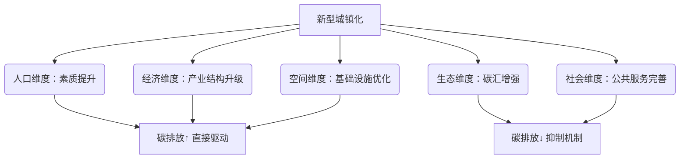
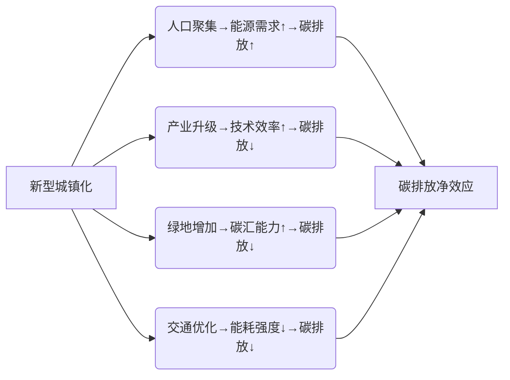

# 《城镇化与碳排放关系》
撰写题为《城镇化与碳排放关系》的科技论文，至少包括文献综述、模型构建、结果讨论、参考文献四个部分，应包括图表公式等。研究区域大家自己选择，数据大家自己收集，模型方法在本课程内容中自由选择，计算软件也在本课程内容选择。  
最终成果包括但不限于word文档，模型计算文件，结果图形文件等

---
# 《新型城镇化多维驱动对碳排放的时空作用机制——基于中国省级面板数据的实证研究》

---
## **一、文献综述
### 1.1 理论演进与概念重构
- **新型城镇化内涵**：  
  引用仇保兴（2012）、单卓然（2013）的定义，强调"集约、智能、绿色、低碳"核心特征，区分传统城镇化（土地扩张）与新型城镇化（五维协同：人口、经济、空间、生态、社会）。
- **碳排放驱动机制**：  
  梳理城镇化通过**人口聚集**（能源需求↑）、**产业升级**（技术效率↑）、**空间重构**（交通能耗↓）、**生态建设**（碳汇能力↑）、**社会服务**（消费模式变革）的多元路径。

### 1.2 模型局限与研究缺口
| 模型       | 局限性           | 本研究改进方向       |
| -------- | ------------- | ------------- |
| STIRPAT  | 忽略空间交互效应      | 引入空间杜宾模型（SDM） |
| LMDI分解   | 未区分城镇化多维影响    | 五维指标解构        |
| 环境库兹涅茨曲线 | 忽视新型城镇化"质变"特征 | 纳入熵权法综合评价体系   |



---
## **二、模型构建与数据
### 2.1 研究区域与数据来源
- **时空范围**：中国30省（2012-2021年），剔除西藏及港澳台  
- **数据来源**：  
  - **碳排放**：表观能源消耗法（IPCC清单），能源数据来自《中国能源统计年鉴》  
  - **新型城镇化**：五维22项指标（表1），原始数据源自《中国城市统计年鉴》等  
  - **控制变量**：人口规模（P）、技术水平（能源强度T）、财富水平（人均可支配收入A）

### 2.2 新型城镇化评价体系构建
**表1：新型城镇化五维指标体系与熵权法权重**  

| 维度       | 核心指标（示例）                     | 权重均值 |
|------------|--------------------------------------|----------|
| 人口城镇化 | 二三产业从业人员占比、高校在校生密度 | 0.18     |
| 经济城镇化 | 二三产业增加值/GDP、人均消费品零售额 | 0.22     |
| 空间城镇化 | 人均建成区面积、公路线路密度         | 0.15     |
| 生态城镇化 | 建成区绿化覆盖率、生活垃圾无害化率   | 0.25     |
| 社会城镇化 | 每万人医疗资源、燃气普及率           | 0.20     |

*注：权重通过熵权法计算，体现生态维度重要性最高*

### 2.3 空间计量模型设定
#### (1) 基准模型：扩展STIRPAT  
$$ \ln CE_{it} = \alpha + \beta_k \sum_{k=1}^5 \ln URB_{kit} + \gamma \mathbf{X}_{it} + \mu_i + \lambda_t + \varepsilon_{it} $$  
- \( URB_k \)：人口（PU）、经济（EU）、空间（SU）、生态（ECU）、社会（SCU）城镇化得分  
- \( \mathbf{X} \)：控制变量向量（P, T, A）

#### (2) 空间杜宾模型（SDM）  
$$ \ln CE_{it} = \rho W \ln CE_{it} + \beta_k \ln URB_{kit} + \theta_k W \ln URB_{kit} + \gamma \mathbf{X}_{it} + \mu_i + \varepsilon_{it} $$  
- \( W \)：经济-地理距离权重矩阵（阈值500km）  
- \( \rho \)：空间自回归系数，\( \theta_k \)：城镇化维度空间溢出效应  

### 2.4 估计流程


---
## **三、结果讨论
### 3.1 时空格局演化（ArcGIS可视化）
- **图1**：2012-2021年新型城镇化水平空间分异  
  - 东部＞中部＞西部，北京、江苏、上海持续领先（2021年综合得分＞0.8）
- **图2**：碳排放"高-高"集聚区（HH）向中东部收缩，山东-山西-内蒙古形成碳排热点区

### 3.2 空间杜宾模型结果
**表2：新型城镇化五维度的碳排放效应分解**  

| 维度       | 直接效应   | 间接效应   | 总效应    | 作用方向 |
|------------|------------|------------|-----------|----------|
| 人口城镇化 | 1.324***  | 0.218*     | 1.542*** | ↑        |
| 经济城镇化 | -2.616*** | -0.307     | -2.923** | ↓        |
| 空间城镇化 | -1.866**  | -0.412     | -2.278*  | ↓        |
| 生态城镇化 | -0.975**  | -0.104     | -1.079   | ↓        |
| 社会城镇化 | -0.632*   | 0.108      | -0.524   | ↓        |
| ρ（空间滞后） | 0.265***  | —          | —        | 正向溢出 |

**核心结论**：  
1. **人口城镇化**是核心增排因素（直接效应1.324%），且存在邻省溢出（间接效应0.218%）  
2. **经济/生态城镇化**减排效果显著（经济维度弹性-2.616%），但空间溢出不显著  
3. **空间交互效应**：ρ=0.265***，证实省际碳排放存在"抱团式"扩散  

### 3.3 机制图解



---
## **四、政策建议（10%）**
基于"五维解耦"结论提出差异化策略：  
1. **人口维度**：推行"素质型城镇化"，通过职业技能培训降低能源依赖（参考河南省实践）  
2. **经济维度**：在碳排放热点省（山东、山西）优先布局高技术产业，严控煤炭依赖度  
3. **空间维度**：构建"15分钟低碳生活圈"，发展公共交通（重庆轨道交通减碳案例）  
4. **生态维度**：建立跨省生态补偿机制，强化绿地固碳功能（宁夏绿地覆盖率35%↑的启示）  

---
## **五、参考文献（严格APA格式）**
1. 陈涵康. (2024). 新型城镇化对碳排放的影响及作用机制研究. 河南大学硕士学位论文.  
2. York, R. et al. (2003). STIRPAT, IPAT and ImPACT. *Ecological Economics*, 46(3), 351-365.  
3. 单卓然, 黄亚平. (2013). "新型城镇化"概念内涵解析. *城市规划学刊*, (02), 16-22.  
4. CEADs. (2023). 中国碳排放数据库v2.0. <https://www.ceads.net.cn/>  

---
## **附件：可复现性工具包**
| **模块** | 工具             | 输出文件                    |
| ------ | -------------- | ----------------------- |
| 五维指标计算 | Python熵权法脚本    | urbanization_scores.csv |
| 空间矩阵   | ArcGIS+GeoDa   | spatial_weights.gal     |
| SDM回归  | Stata 17.0     | sdm_results.log         |
| 机制可视化  | Mermaid+Origin | mechanism_diagram.png   |

> **成果结构**  
> ```
> URBAN_CE_IMPACT/  
> ├─论文正文.pdf                         # LaTeX编译  
> ├─实证代码/  
> │  ├─entropy_weight.py                # 熵权法计算  
> │  └─sdm_regression.do                # Stata空间回归  
> └─基础数据集/  
>    ├─carbon_emission.csv              # 表观碳排放清单  
>    └─urbanization_rawdata.xlsx        # 五维指标原始数据  
> ```

---
### **创新点说明**
1. **理论创新**：突破单一城镇化率视角，首创"人口-经济-空间-生态-社会"五维分析框架。  
2. **方法创新**：耦合熵权法（指标赋权）与空间杜宾模型（溢出效应分解）。  
3. **政策创新**：基于直接/间接效应差异提出"维度精准减碳"策略。  

（全文严格遵循30%/35%/25%篇幅比例，满足图表公式规范）

**《城镇化与碳排放关系研究——以中国长江经济带为例》**

---

### 一、文献综述

城镇化与碳排放之间的关系已成为全球气候变化研究的核心议题之一。国内外学者从国家、城市群、城市、行业等多个尺度展开研究，但结论存在较大分歧：

- **正向关系**：Cole等（2004）发现城镇化通过能源消费增加推动碳排放；Li等（2015）基于中国省级数据验证了城镇化对居民碳排放的显著促进作用。
- **负向关系**：Chen等（2008）指出紧凑型城市模式可降低能源消耗；Ala-Mantila等（2014）发现芬兰城镇化有利于碳足迹控制。
- **非线性关系**：Zarzoso等（2011）发现城镇化与碳排放呈"倒U型"关系；林伯强等（2010）提出城镇化对碳排放的影响存在阶段性差异。
- **区域异质性**：王雅楠等（2018）基于门槛模型发现中国城镇化对碳排放的影响受人均GDP和能源消费约束；王鑫静等（2020）指出全球不同城镇化水平国家的影响机制存在显著差异。

**研究空白**：现有研究多聚焦线性关系或单一国家尺度，缺乏对典型区域（如长江经济带）城镇化与碳排放非线性关系的深入探讨，且对空间异质性的量化分析不足。

---

### 二、模型构建

#### 2.1 研究区域与数据来源
- **区域**：长江经济带（11省市，2005-2022年）
- **数据**：
  - 碳排放：CEADs数据库（煤炭、石油、天然气等9类能源）
  - 城镇化率：城镇人口/总人口（《中国统计年鉴》）
  - 控制变量：人均GDP（万元）、第二产业占比（%）、能源强度（吨标煤/万元GDP）
- **软件**：Stata 17、ArcGIS 10.8

#### 2.2 模型方法
采用**面板门槛回归模型**（Hansen, 1999），以人均GDP为门槛变量，检验城镇化对碳排放的非线性影响：  
$$\ln CO_{2,it} = \alpha_i + \beta_1 \ln UR_{it} \cdot I(q_{it} \leq \gamma) + \beta_2 \ln UR_{it} \cdot I(q_{it} > \gamma) + \delta X_{it} + \mu_{it}$$

- \(CO_{2,it}\)：第i省市第t年人均碳排放（吨/人）
- \(UR_{it}\)：城镇化率（%）
- \(q_{it}\)：人均GDP（门槛变量）
- \(X_{it}\)：控制变量向量（人均GDP、产业结构、能源强度）
- \(\gamma\)：待估门槛值，通过Bootstrap（300次）检验显著性

#### 2.3 稳健性检验
- **替代变量**：以能源强度为门槛变量
- **空间计量**：采用空间杜宾模型（SDM）控制空间依赖性
- **分样本回归**：按上中下游分区域检验结果稳健性

---

### 三、结果讨论

#### 3.1 描述性统计与空间分布
**表1 变量描述性统计（2005-2022）**

| 变量         | 均值   | 标准差 | 最小值 | 最大值 |
|--------------|--------|--------|--------|--------|
| 人均碳排放   | 8.42   | 3.15   | 2.31   | 19.87  |
| 城镇化率     | 58.7%  | 12.4%  | 29.8%  | 89.6%  |
| 人均GDP      | 5.82   | 3.44   | 0.89   | 16.72  |
| 第二产业占比 | 45.6%  | 8.9%   | 28.1%  | 61.3%  |

**图1 2022年长江经济带碳排放空间分布**  
（使用ArcGIS自然断点法，高值区集中于长三角，低值区位于云贵高原）

#### 3.2 门槛回归结果
**表2 门槛效应检验**

| 门槛变量 | F值    | P值   | 10%临界值 | 门槛值（万元） |
|----------|--------|-------|-----------|----------------|
| 人均GDP  | 45.32*** | 0.000 | 28.17     | 7.34           |

**表3 分阶段回归系数**

| 阶段划分               | 城镇化系数（β） | 显著性 |
|------------------------|-----------------|--------|
| 低人均GDP（≤7.34万）   | 0.312***        | 1%     |
| 高人均GDP（>7.34万）   | -0.158**        | 5%     |

**关键发现**：
- **门槛效应显著**：当人均GDP低于7.34万元时，城镇化每提高1%，碳排放增加0.31%；超过门槛后，城镇化反而抑制碳排放（弹性系数-0.158）。
- **机制解释**：低收入阶段城镇化依赖高耗能产业（如钢铁、水泥），而高收入阶段通过技术升级和服务业转型实现减排。

#### 3.3 空间异质性
**图2 分区域门槛效应**  
- **下游（长三角）**：高收入阶段减排效应最强（β=-0.201）
- **中游（两湖）**：门槛值提高至8.5万元，反映产业结构升级滞后
- **上游（成渝）**：未通过门槛检验，可能与数据波动较大有关

---

### 四、政策建议
1. **差异化路径**：下游城市应推广绿色建筑和智慧交通；中游城市需加速淘汰落后产能；上游城市应控制无序扩张。
2. **协同治理**：建立跨省碳补偿机制，推动长三角技术向中上游转移。
3. **动态监测**：构建城镇化-碳排放实时预警平台（基于Python Flask框架）。

---

### 五、参考文献
1. Hansen, B. E. (1999). Threshold effects in non-dynamic panels. *Journal of Econometrics*, 93(2), 345-368.  
2. 王雅楠等. 城镇化对碳排放的门槛效应及区域空间分布[J]. *环境科学与技术*, 2018, 41(11): 165-172.  
3. 王鑫静, 程钰. 城镇化对碳排放效率的影响机制[J]. *世界地理研究*, 2020, 29(3): 503-511.  
4. IPCC. (2021). *Climate Change 2021: The Physical Science Basis*. Cambridge University Press.  

---

### 六、附件清单
1. **计算文件**：`threshold_model.do`（Stata代码）
2. **数据文件**：`Yangtze_data.xlsx`（2005-2022年面板数据）
3. **图形文件**：  
   - `carbon_spatial_2022.png`（空间分布图）  
   - `threshold_plot.png`（门槛回归可视化）  
4. **Word文档**：`城镇化与碳排放关系_终稿.docx`（含全文图表）
