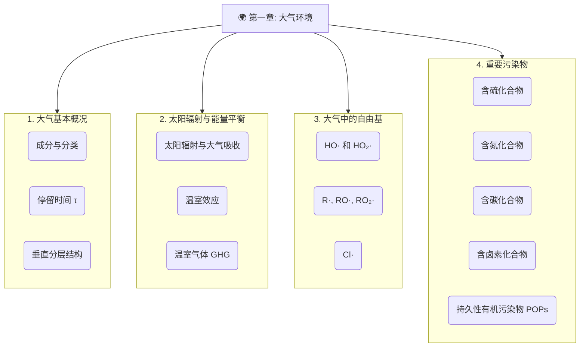

# 01 大气环境及其重要污染物

- **大气**：包围在地球表面并随地球一起旋转的空气层。
- **重要作用**：
    - 提供生命所需气体 (O₂, N₂, CO₂)。
    - 参与地球水循环。
    - 维持地球热量平衡（"小棉袄"）。
    - 是各种化学物质迁移、转化和循环的宏大场所。

---

## 01-1 大气的主要成分与结构**

### **1. 大气成分与分类**
- **主要成分 (不变的大佬们)**:
    - 氮气 ($N_2$): 78.08%
    - 氧气 ($O_2$): 20.95%
    - 氩气 ($Ar$): 0.934%
- **可变组分 (浓度会变的小伙伴们)**:
    - 二氧化碳 ($CO_2$): ~0.04% (并且还在悄悄上涨！)
    - 水蒸气 ($H_2O$): 1-3%，变化非常大。

| 类别 | 示例 | 停留时间 | 分布特征 |
| :--- | :--- | :--- | :--- |
| **准永久气体** | N₂, O₂, Ar | >10³ 年 | 全球混合均匀 |
| **可变组分** | CO₂, CH₄, N₂O | 数年至百年 | 局部有差异，但大尺度较均匀 |
| **强可变组分** | SO₂, NOₓ, H₂O, CO | 数天至数月 | 极不均匀，主要集中在源附近 |

### **2. 大气成分的停留时间**

大气系统既是动态系统，也是稳态系统。

- **停留时间 ($\tau$)**: 某个组分在大气中存在的**平均时间**。
- **停留时间公式 (稳态时)**:
    $$
    \tau = \frac{M}{P + I} = \frac{M}{R + O}
    $$
    - $M$ : 污染物总量。
    - $P$ : 生成速率； $I$: 流入速率。
    - $R$ : 去除速率； $O$: 流出速率。
- **核心结论**: **停留时间越长，分布越均匀**。
    - 全球混合均匀大约需要1-2年。所以停留时间远大于2年的气体（如$N_2, O_2, CO_2$），在全球分布就比较均匀。
    - 停留时间只有几天（如$SO_2, H_2O$），就主要集中在污染源或特定区域附近，分布很不均匀。
### **3. 大气的主要层次**

| 层次      | 高度范围 (km)    | 温度变化趋势                  | 主要成分/特征                                   |
| :------ | :----------- | :---------------------- | :---------------------------------------- |
| **对流层** | 0 ~ (10-16)  | 随高度**降低** (-0.6°C/100m) | N₂, O₂, CO₂, H₂O；**天气现象发生层**，大气污染主要发生在此层。 |
| **平流层** | (10-16) ~ 50 | 随高度**升高**               | O₃；**臭氧保护伞**，吸收紫外线，吸收紫外线导致升温。飞机喜欢在这层飞。    |
| **中间层** | 50 ~ 80      | 随高度**降低**               | O₂⁺, NO⁺；**大气最冷层**，温度可达-92°C，流星在这里燃烧。     |
| **热层**  | 80 ~ 500     | 随高度**急剧升高**             | O₂⁺, O⁺, NO⁺；**电离层**，极光                   |
| **散逸层** | > 500        | 极高温                     | H, He；大气最外层，气体可逃逸                         |

---

## **01-2 温室效应**

### 1. **什么样的气体才成为温室气体**
- **条件一：分子会"振动"**
    - 吸收红外线能量，其实就是让分子内部的化学键振动起来。单原子分子（如Ar）没有化学键，没法振动，所以不是温室气体。
- **条件二：**分子的振动必须是不对称的，能够引起分子的偶极矩变化**
    - **偶极矩**可以通俗理解为分子内部正、负电荷中心的分离程度。
    - 对称的双原子分子，如$N_2, O_2$，振动时还是对称的，偶极矩始终为零，无法吸收红外线。
    - 非对称分子，如$H_2O$，本身就有偶极矩。
    - 对称分子，如$CO_2, CH_4$，虽然静态时没有偶极矩，但它们在某些振动模式下会变得不对称，产生瞬时偶极矩，也能吸收红外线。

    > **偶极矩**是指在分子中，由于电荷分布不均匀而形成的电荷分离现象，它表示分子内正负电荷中心的不重合程度。简单说，就是分子有没有"正电中心"和"负电中心"。$CO_2$虽然是对称分子，但它的某些振动方式会破坏对称性，产生瞬时偶极矩，所以也能吸收红外线。

### 2. **影响温室效应的因素**

- **温室气体的浓度**: 浓度越高，效应越强，所以 $H_2O$ 和 $CO_2$ 是主导。
- **红外吸收能力**: 分子结构决定吸收效率，CFCs 和 $SF_6$ 是超强吸收剂。
- **吸收波长**: 若吸收峰落在**大气窗 (8-13 μm)**，温室效应会显著增强。
- **大气停留时间**: 停留时间越长，对气候的长期影响越持久。

---

## 01-3 大气中的自由基

| 自由基                  | 主要来源 (阳光是关键！)                                                                                             | 主要消除途径                                                                   | 在大气中的角色                        |
| :------------------- | :-------------------------------------------------------------------------------------------------------- | :----------------------------------------------------------------------- | :----------------------------- |
| **HO·** (羟基自由基)   | **清洁大气**: $O_3 + h\nu \to O_2 + O^*$;  $O^* + H_2O \to 2HO·$   **污染大气**: $HONO + h\nu \to HO· + NO$ | 与污染物反应 (如 $CO, CH_4$)；  自由基间复合反应 (如 $HO· + NO_2 \to HNO_3$)           | **大气"清洁剂"**，氧化能力极强，是白天最重要的氧化剂。 |
| **HO₂·** (氢过氧自由基) | 醛类光解: $HCHO + h\nu \to … \to HO_2·$   HO·氧化CO: $HO· + CO \to … \to HO_2·$                              | $HO_2· + NO \to HO· + NO_2$ (重要转化)   $HO_2· + HO_2· \to H_2O_2 + O_2$ | HO·的"蓄水池"和转化中继站，在光化学烟雾中扮演重要角色。 |
| **Cl·** (氯原子) | **平流层**: CFCs光解, e.g., $CFCl_3 + h\nu \to Cl· + CFCl_2·$   **对流层(沿海)**: 海盐相关化学过程 | $Cl· + CH_4 \to HCl + CH_3·$ (生成稳定分子) | **臭氧层的"头号杀手"**。 |

---

## 01-4 重要大气污染物
### **4.1 含硫化合物 (S-Family)**
- **$SO_2$ (二氧化硫)**: 主要来自**化石燃料(特别是煤)燃烧**和金属冶炼。是形成**酸雨**和硫酸盐气溶胶的元凶。
- **$H_2S$ (硫化氢)**: 有臭鸡蛋气味，主要来自生物腐烂和火山活动。在大气中会被HO·氧化成$SO_2$。
- **DMS (二甲基硫)**: 主要由**海洋浮游生物**释放，是天然硫循环的重要部分，氧化后形成的硫酸盐气溶胶是重要的**云凝结核**，对气候有调节作用。

### **4.2 含氮化合物 (N-Family)**
- **$NO_x$ (NO + $NO_2$)**: 主要来自**高温燃烧**过程(汽车尾气、发电厂)。
    - **三大形成机理**:
        1. **温度型**: 高温下空气中的$N_2$和$O_2$直接反应 (主要来源)。
        2. **燃料型**: 燃料中含氮化合物燃烧转化。
        3. **瞬时型**: 燃料富燃区碳氢自由基与$N_2$反应。
    - **危害**: 形成**光化学烟雾**和**酸雨**的关键前体物。
- **$N_2O$ (一氧化二氮，笑气)**: 主要来自土壤微生物活动(化肥使用会加剧)。它既是**强温室气体** (GWP ≈ 298)，也是平流层中破坏**臭氧**的物质。

### **4.3 含碳化合物 (C-Family)**
- **CO (一氧化碳)**: **不完全燃烧**的产物。会与HO·反应，参与光化学烟雾过程，并且有毒性。
- **$CO_2$ (二氧化碳)**: 最主要的**温室气体**，主要来自化石燃料燃烧。
- **$CH_4$ (甲烷)**: 主要来自厌氧发酵(湿地、水稻田、反刍动物)。是第二重要的温室气体 (GWP ≈ 28)。
- **非甲烷烃 (NMHC)**: 包括乙烯、萜烯等，来源广泛(植物释放、溶剂挥发、汽车尾气)。它们是形成**光化学烟雾**和**二次有机气溶胶(SOA)**的重要前体物。

### **4.4 含卤素化合物 & 持久性有机污染物 (POPs)**
- **氯氟烃 (CFCs) & 哈龙 (Halons)**: 人造化学品，曾用作制冷剂、灭火剂。
    - **特点**: 在对流层极其稳定(寿命长)，能扩散到平流层。
    - **双重危害**:
        1. **破坏臭氧层**: 在平流层被紫外线光解，释放出Cl·或Br·原子，催化分解$O_3$。
        2. **强温室效应**: 吸收能力强，且吸收波段多在大气窗区。
- **持久性有机污染物 (POPs)**: 如**二噁英(Dioxins)**、**多环芳烃(PAHs)**。
    - **特点**: 难降解、生物蓄积性、高毒性、可远距离传输。
    - **全球蒸馏/蚱蜢跳效应**: POPs在暖和地区挥发进入大气，随气流传输到寒冷地区沉降。如此反复，导致它们在全球范围内（尤其在极地）富集。

| 污染物类型 | 示例 | 主要来源 | 主要危害/环境影响 |
| :--- | :--- | :--- | :--- |
| **含硫化合物** | SO₂, H₂S, DMS | **燃煤**、火山、海洋生物 | **酸雨**、硫酸盐气溶胶、云凝结核 |
| **含氮化合物** | NO, NO₂, N₂O | **高温燃烧** (汽车尾气)、化肥 | **光化学烟雾**、酸雨、臭氧损耗、温室效应 |
| **含碳化合物** | CO, CO₂, CH₄, NMHC | **不完全燃烧**、化石燃料、生物活动 | 温室效应、光化学烟雾前体物、毒性 |
| **含卤素化合物** | CFCs, HCFCs | 人造化学品 (制冷剂等) | **臭氧层破坏**、强温室效应 |
| **持久性有机污染物(POPs)** | PAHs, PCDD/Fs (二噁英) | 燃烧副产物、工业过程 | 致癌、内分泌干扰、生物累积 |

---

---
