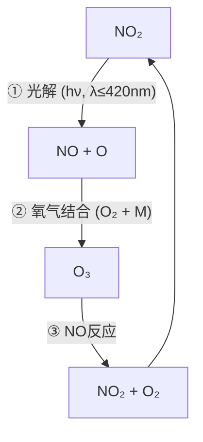

---
---

# 02 大气气相化学反应
## **02-1 光化学基础 — 太阳是大气化学的"能源引擎"！**

大气中很多反应都离不开太阳光的"光顾"，它们不仅提供能量，还启动了复杂的化学链条。

### **1.1 光化学基本定律 (光化学反应的"两大门规")**

这两条定律是理解大气光化学反应的基石，就像是自然界的"宪法"！

| 定律 | 内容详解 | 公式/关键点拓展 |
| :--- | :--- | :--- |
| **Grotthus-Draper定律**<br>(光化学第一定律) | 只有**被分子吸收**的光能才能引发化学反应。这意味着如果一个分子不吸收特定波长的光，那么无论光有多强，都不会对其产生光化学效应。此外，吸收的光子能量必须**足够大**，才能打断化学键（即达到或超过化学键的解离能），或引发电子从基态跃迁到激发态。 | 能量公式: $E = N_0 h \nu = \frac{N_0 h c}{\lambda}$<br>其中，$N_0$ 为阿伏伽德罗常数，$h$ 为普朗克常数，$c$ 为光速，$\nu$ 为光的频率，$\lambda$ 为光的波长。 <br> **光解阈值**: 平均化学键能大约为 $167.4 \text{ kJ/mol}$。根据能量公式，这对应于波长 $\lambda < 700 \text{ nm}$ 的光。只有能量高于键解离能的光子，才能有效**打断化学键**，引发光解反应。例如，平流层臭氧层之所以能吸收大部分紫外线，正是因为臭氧分子吸收紫外光后会发生光解。 |
| **Stark-Einstein定律**<br>(光化学第二定律) | 在普通的、非高强度（如激光）光照条件下，一个分子在发生**初级光化学过程**时，只能吸收**一个光子**，并由基态进入激发态。这强调了光与分子相互作用的**量子化特性**。 | $1\ \text{分子} + 1\ \text{光子} \rightarrow \text{激发态分子}$<br>这个定律为光化学反应的定量研究奠定了基础。虽然一个光子只能被一个分子吸收，但一个激发态分子可能通过一系列次级反应，引发多个其他分子的变化，所以最终的**总量子产率**可能大于1。 |

### **1.2 光化学反应过程 (从吸收光到"搞事情"的链条)**

光化学反应不仅仅是吸收光那么简单，它还涉及一系列复杂的后续步骤。

| 阶段 | 类型 | 示例 | 说明与拓展 |
| :--- | :--- | :--- | :--- |
| **初级过程** | **光物理过程**: 分子吸收光能后，能量发生转移，但**不发生化学键的断裂或重组**，不产生新物质。常见的有荧光、磷光、内转化、系间窜越、碰撞失活等。<br>**光化学过程**: 分子吸收光能后，**发生化学键的断裂或重组**，产生新的化学物质。通常是自由基或激发态物种。 | **光物理举例**: $A^* + M \rightarrow A + M$ (激发态分子A\*通过与第三体分子M碰撞，将能量传递给M而失活，变回基态A)。<br>**光化学举例**: $\text{NO}_2 \xrightarrow{h\nu} \text{NO} + \text{O}$ (二氧化氮分子吸收光子后，N-O键断裂，生成一氧化氮和氧原子)。 | 初级过程是光化学反应的**第一步**，是分子直接与光子作用的结果。它是后续所有化学转化的起点，尤其重要的是能产生**自由基**，这些自由基将启动复杂的链式反应。 |
| **次级过程** | 由初级过程的产物（尤其是**高活性的自由基或激发态物种**）引发的**一系列连锁反应**。这些反应通常是**热化学反应**（不直接需要光能），但却是光化学反应链条的核心。 | **举例**: 在$\text{NO}_2$光解后产生的O原子，会立即与大气中的氧气分子结合，在第三体分子M的帮助下生成臭氧：$\text{O} + \text{O}_2 + M \rightarrow \text{O}_3 + M$。这个臭氧的生成就是由初级产物O原子引发的次级过程。 | 次级过程往往是决定光化学反应**整体速率和产物种类**的关键。它们使得一个光子引发的反应能够被放大，形成链式反应，在大气中产生大量二次污染物。 |

### **1.3 量子产率 ($\Phi$) (衡量光化学反应效率的指标)**

量子产率是评价光化学反应效率高低的一个重要参数。

- **定义**：物质每吸收**一个光子**，能够导致发生化学反应的**分子数**（可以是反应物消耗数，也可以是产物生成数）。
$$
\Phi = \frac{\text{反应物消耗或产物生成的分子数}}{\text{吸收的光子数}}
$$
- **初级量子产率 ($\phi$)**: 仅考虑**初级光化学过程**。由于在初级过程中，部分激发态分子可能会通过光物理过程失活而没有发生化学反应，所以初级量子产率 $\phi \le 1$。
- **总量子产率 ($\Phi$)**: 考虑初级过程和**所有次级过程**。
    - 如果次级过程消耗了初级产物，$\Phi < \phi$。
    - 如果次级过程是**链式反应**，即一个自由基引发的反应可以持续进行，不断再生出新的自由基，那么总量子产率 $\Phi$ 可以**远大于1**，甚至达到 $10^6$ 或更高！这说明一个光子可以引发数百万个分子的转化。
    - **经典案例**: $H_2 + Cl_2 \xrightarrow{h\nu} 2HCl$ 的反应，其总量子产率 $\Phi$ 可高达 $10^6$，是典型的**自由基链式反应**。一个光子引发Cl·自由基，随后Cl·和H·自由基反复进行链传递，使得反应高效进行。

---

## **02-2 自由基化学 — 大气中的"超级英雄"与"破坏者"！**

自由基是大气化学中的**核心活性物种**，它们就像"火种"，点燃并维持着复杂的化学反应网络。

### **2.1 自由基的产生与性质 (谁是自由基？它们有什么脾气？)**

自由基的生成和特性决定了它们在大气中的"影响力"。

| 生成方式 | 示例反应与拓展 | 稳定性排序 (越稳定越容易生成，但活性越低) | 活性/选择性 |
| :--- | :--- | :--- | :--- |
| **光解法** | 分子吸收光子后，化学键**均裂**产生自由基。这是大气中自由基最主要的生成方式。例如：<br>$\text{NO}_2 + h\nu \rightarrow \text{NO} + \text{O}\cdot$<br>$\text{Cl}_2 + h\nu \rightarrow 2\text{Cl}\cdot$ | 自由基的稳定性主要受其**电子结构**和**空间位阻**影响：<br>1. **共轭/超共轭效应**：例如烯丙基自由基($\text{CH}_2=\text{CH}-\text{CH}_2\cdot$)和苯甲基自由基，由于未成对电子能够离域或与邻近键形成超共轭，稳定性显著提高。<br>2. **诱导效应**：烷基具有供电子效应，能稳定带正电的碳，也能部分稳定自由基中心。因此，**叔碳自由基** ($R_3C\cdot$) > **仲碳自由基** ($R_2CH\cdot$) > **伯碳自由基** ($RCH_2\cdot$) > **甲基自由基** ($\text{CH}_3\cdot$)。 | **活性**: 通常由其**未成对电子的"饥饿程度"**决定。例如，F·由于电负性极高，对电子的吸引力极强，活性最高。**F· > Cl· > Br·** (活性递减)。<br>**选择性**: 活性越高的自由基，其反应越**不挑剔**（选择性越差），倾向于与遇到的第一个分子反应；而活性较低的自由基，则更**有选择性**，会倾向于攻击更易反应的位点。因此：**Br· >> Cl· > F·** (选择性递增)。<br>**老师悄悄话**: 想象一下，一个超级饿的人（F·）什么都吃，一个没那么饿的人（Br·）就挑食了。 |
| **热裂解法** | 在**高温**条件下，分子共价键均裂产生自由基。在燃烧过程或工业高温反应中常见。例如：<br>$\text{CH}_3\text{CH}_3 \xrightarrow{\Delta} 2\ \text{CH}_3\cdot$ (乙烷在高温下裂解生成甲基自由基)。 | 与**R-H 键的键解离能 (D)** 相关。键解离能越**低**的键，越容易在较低温度下均裂生成自由基，形成的自由基也相对越稳定。反之，键解离能越**高**的键，均裂需要更高能量，生成的自由基也越不稳定。 | 高温通常会使反应的活化能差异减小，从而**降低反应的选择性**。因为分子获得更多能量后，即使是平时"难啃"的键也变得容易攻击了。 |
| **其他生成方式** | **化学键非均裂**: 如一些氧化还原反应，产生离子自由基。<br>**原子/自由基与分子反应**: 如O原子与$O_2$结合形成$O_3$ (虽然O3不是自由基，但这个过程涉及到O原子的自由基性质)。 | | |

### **2.2 自由基链式反应 (核心三部曲 — 自由基的"生命周期")**

自由基链式反应是大气化学中许多复杂现象的根本，一个自由基可以像"多米诺骨牌"一样，引发一系列连锁反应。

```mermaid
graph TD
    subgraph 自由基链式反应
        direction LR
        A[链引发<br>Initiation] --> B[链增长/传递<br>Propagation];
        B --> C[链终止<br>Termination];
    end

    A --> A1[Cl₂ + hν → 2Cl· <br> (**从无到有生成自由基**，如光解、热解)];
    B --> B1[Cl· + CH₄ → HCl + CH₃· <br> (一个自由基消耗，同时生成另一个新的自由基)];
    B1 --> B2[CH₃· + Cl₂ → CH₃Cl + Cl· <br> (**自由基再生**，种类和数量基本不变，反应持续进行)];
    C --> C1[Cl· + Cl· → Cl₂ <br> (两个自由基结合，**自由基消失**，链反应停止)];
    C --> C2[Cl· + CH₃· → CH₃Cl <br> (不同自由基结合)];
```

- **链引发 (Initiation)**：这是链反应的**起始阶段**。通过吸收光能（光解）或热能（热裂解），稳定的分子被分解，产生具有高活性的自由基。这是整个链反应的"火种"。
- **链增长/传递 (Propagation)**：这是链反应的**核心阶段**。一个自由基与一个稳定的分子反应，生成一个新的稳定分子，同时产生一个新的自由基。在这个过程中，自由基的**种类可能改变，但其数量通常保持不变**或增多（链支化），从而使反应能够持续进行。
- **链终止 (Termination)**：这是链反应的**结束阶段**。两个自由基相互结合，形成一个稳定的分子。此时，自由基的数量减少，链反应停止。通常发生在自由基浓度达到一定水平，相互碰撞几率增大时。

---

## **02-3 氮氧化物(NOx)反应 (大气中"O₃"的调控大师)**

氮氧化物 ($NO_x$，主要是NO和$NO_2$) 在大气中扮演着双重角色：它们既是重要的**一次污染物**，又是影响臭氧($O_3$)生成和消耗的**关键组分**。

### **3.1 NO、NO₂与O₃的光化学循环 (大气O₃的背景舞蹈 — "假平衡"的迷惑)**

这个循环被称为"无效循环"是因为在没有其他有机物（VOCs）参与的情况下，它**不会导致O₃的净积累**。



- **反应详解**:
    1. **$NO_2$光解**: $\text{NO}_2 + h\nu (\lambda \le 420 \text{ nm}) \xrightarrow{\text{光}} \text{NO} + \text{O}\cdot$ (产生O原子，这是对流层O₃生成的**第一步**)。
    2. **$O_3$生成**: $\text{O}\cdot + \text{O}_2 + M \rightarrow \text{O}_3 + M$ (O原子与氧气分子结合，在第三体分子M的帮助下生成O₃)。
    3. **$O_3$消耗**: $\text{NO} + \text{O}_3 \rightarrow \text{NO}_2 + \text{O}_2$ (一氧化氮与臭氧反应，消耗O₃并再生$NO_2$)。
- **稳态关系**: 在这个简单的循环里，当系统达到动态平衡时，$O_3$的浓度与$NO_2$和$NO$的浓度比值呈正比：
$$
[O_3] = \frac{k_1}{k_3} \frac{[NO_2]}{[NO]}
$$
其中 $k_1, k_3$ 分别是反应①和③的速率常数。这意味着，如果只有这个循环，大气中的$O_3$浓度会被$NO$的消耗作用所限制，**不会出现严重的O₃污染**。
- **打破平衡的关键**: 真正导致对流层O₃污染的是，必须有**其他物质**（特别是**有机物自由基，如RO₂·和HO₂·**）来把$NO$氧化成$NO_2$，而且这个氧化过程**不能消耗O₃**。这样，O₃就失去了被NO消耗的"敌人"，从而得以净积累。

### **3.2 NO₃自由基 (夜间化学的"神秘刺客")**

$NO_3\cdot$是夜间大气中最重要的氧化剂，其行为与白天的HO·截然不同。

- **来源**: 主要在**夜间**，当太阳光消失，NO浓度降低后，二氧化氮可以与臭氧反应生成$NO_3\cdot$。
    $$
    \text{NO}_2 + \text{O}_3 \rightarrow \text{NO}_3\cdot + \text{O}_2
    $$
- **特点**:
    - **光敏感性极强**: $NO_3\cdot$极易光解，即使是微弱的可见光也能使其分解。
        $$
        \text{NO}_3\cdot + h\nu \xrightarrow{\text{白天}} \text{NO}_2 + \text{O}\cdot \quad (\lambda < 580 \text{ nm})
        $$
        $$
        \text{NO}_3\cdot + h\nu \xrightarrow{\text{白天}} \text{NO}\cdot + \text{O}_2 \quad (\lambda < 700 \text{ nm})
        $$
        因此，白天$NO_3\cdot$的寿命仅有几秒，浓度极低。
    - **NO清除**: $NO_3\cdot$也能被$NO$快速清除，所以当夜间$NO$浓度仍较高时，$NO_3\cdot$的浓度也难以积累。
        $$
        \text{NO} + \text{NO}_3\cdot \rightarrow 2\text{NO}_2
        $$
    - **夜间氧化剂**: 只有在**夜间且NO浓度较低**时，$NO_3\cdot$才能积累到足以发挥作用的浓度。此时，它是重要的氧化剂，能与多种VOCs（尤其是**不饱和烃**，如烯烃、芳香烃）反应，启动其氧化过程。
- **作用**:
    - **VOCs去除**: 是夜间去除VOCs的重要途径。
    - **硝酸形成**: $NO_3\cdot$与某些VOCs反应（如摘氢）可生成硝酸($HNO_3$)。
    - **二次有机气溶胶(SOA)形成**: $NO_3\cdot$与不饱和有机物反应生成的产物，易凝结形成低挥发性物质，是夜间形成SOA的重要推手。

---

## **02-4 二氧化硫(SO₂)反应 (酸雨的"前体杀手")**

二氧化硫 ($SO_2$) 是酸雨和二次硫酸盐气溶胶的主要前体物。其在大气中的去除和转化，主要是通过氧化反应生成三氧化硫($SO_3$)，进而水合形成硫酸($H_2SO_4$)。

### **1. 光吸收特性 — $SO_2$的"光子吞噬术"**
$SO_2$吸收不同波长的光，会进入不同的激发态，这是其光化学反应的起点。
#### **$SO_2$的光谱吸收带**

| **波长范围** | **吸收强度** | **激发态** | **主要光化学行为** | **对流层意义** |
| :----------- | :----------- | :----------- | :----------- | :----------- |
| **240–330 nm (UV-B)** | 强吸收 | **单线态（¹SO₂）** | 能量较高，易发生**光物理过程**（如荧光、内转化、碰撞失活），也可发生极少量**光解** (SO₂\* → SO + O，但极少)。 | 在对流层，这一波段的UV-B光大部分被臭氧层吸收，**到达地面的光强度较低**，因此对流层中此路径**贡献有限**。 |
| **340–400 nm (UV-A / 近可见光)** | 弱吸收 | **三线态（³SO₂）** | 能量相对较低，**寿命较长**，更倾向于通过与O₂等分子反应，参与**间接光氧化**。 | **对流层主要关注的激发态**。虽然吸收弱，但由于UV-A到达地面强度较大，且³SO₂\*寿命相对长，使其能参与后续反应。 |
| **<240 nm (UV-C)** | 极强吸收 | 高能态 | 吸收高能光子后，SO₂可以直接解离（键断裂）。 | **对流层中无意义**。UV-C光在平流层就被$O_2$和$O_3$完全吸收，**无法到达对流层**。 |

**深入理解**：

- **SO₂键能**：S=O双键的键能约为 $545.1 \text{ kJ/mol}$。根据 $E = \frac{N_0 h c}{\lambda}$ 计算，这对应于波长约 $220 \text{ nm}$ 的光。这意味着只有波长**小于 $220 \text{ nm}$** 的光才能直接打断S=O键，使SO₂光解为S+O₂或S+2O。
- **对流层光照限制**：由于到达对流层的太阳光波长通常大于 $290 \text{ nm}$，因此SO₂在对流层中**无法被直接光解为原子或简单分子**。它吸收光子后只能形成**激发态分子（SO₂\*）**，然后由激发态分子进行后续反应。
- **激发态的命运**：大部分激发态的$SO_2^* $（尤其是高能的单线态）会通过与周围分子碰撞而**失活（quenching）**，将能量转化为热能，而不会发生化学反应。这解释了为什么直接光氧化对SO₂在大气中的清除贡献较小。

---

| 类型                   | 反应示例与拓展                                                                                                                                                                                                                                                                                                                                                                           | 产物                                   | 贡献/重要性                                                                                                                   |
| :------------------- | :-------------------------------------------------------------------------------------------------------------------------------------------------------------------------------------------------------------------------------------------------------------------------------------------------------------------------------------------------------------------------------- | :----------------------------------- | :----------------------------------------------------------------------------------------------------------------------- |
| **直接光氧化**            | $\text{SO}_2 \xrightarrow{h\nu} \text{SO}_2^*$ (激发态二氧化硫)<br>激发态的 $\text{SO}_2^*$ 可以与 $\text{O}_2$ 反应：<br>$\text{SO}_2^* + \text{O}_2 \rightarrow \text{SO}_3 + \text{O}$<br>生成的 $\text{SO}_3$ 会迅速与水分子结合形成硫酸：$\text{SO}_3 + \text{H}_2\text{O} \rightarrow \text{H}_2\text{SO}_4$                                                                                                  | $\text{SO}_3$，进而生成**硫酸盐气溶胶**（主要是硫酸）。 | **贡献较小** (<5%)。这是因为，尽管SO₂能够吸收紫外光，但大部分激发态的SO₂\*分子在发生化学反应之前，会通过与大气中的其他分子（M）碰撞而**快速失活**（即光物理过程）。所以，这种直接光氧化并非SO₂在大气中的主要去除途径。 |
| **间接光氧化<br>(自由基氧化)** | 这是SO₂气相氧化的**绝对主力**！主要通过**羟基自由基(HO·)**的攻击来完成。<br>1. HO·与SO₂加成：<br>$\text{SO}_2 + \text{HO}\cdot \rightarrow \text{HOSO}_2\cdot$ (亚磺酸自由基)<br>2. 亚磺酸自由基与氧气反应：<br>$\text{HOSO}_2\cdot + \text{O}_2 \rightarrow \text{HO}_2\cdot + \text{SO}_3$<br>3. $SO_3$水合：<br>$\text{SO}_3 + \text{H}_2\text{O} \rightarrow \text{H}_2\text{SO}_4$<br>此外，其他自由基如RO₂·、Criegee中间体等也可能氧化SO₂，但贡献不如HO·。 | $\text{SO}_3$，最终生成**硫酸(H₂SO₄)**气溶胶。  | **绝对主力！** 贡献高达**80%左右**。HO·自由基是白天大气中浓度最高的强氧化剂，对SO₂的氧化效率极高。这个过程是大气中硫酸盐气溶胶（PM2.5的重要组分）和酸雨形成的最主要气相途径。                       |

### **2. 直接光氧化 — "慢热型"的SO₂转化途径**

直接光氧化是指激发态$SO_2^*$直接与氧气等分子反应，不经过自由基链式反应。

#### **激发态$SO_2^*$的反应路径**

```mermaid
graph TD
  A[SO₂ + hν] --> B[SO₂* (激发态，主要是³SO₂*)]
  B --与O₂反应 (较慢)--> C[形成中间体SO₄]
  C --> D1[分解为SO₃ + O]
  C --> D2[与SO₂反应生成2SO₃]
```

**关键反应式**：

- **激发态$SO_2^*$与$O_2$反应**：  
    `³SO₂* + O₂ → SO₄` (形成一个不稳定的中间体SO₄)  
    `SO₄ → SO₃ + O` (或 `SO₄ + SO₂ → 2SO₃`)
- **最终产物**：$SO_3$（三氧化硫）。
    - $SO_3$在大气中极不稳定，会迅速与水分子($H_2O$)反应，形成**硫酸（$H_2SO_4$）**。  
    `SO₃ + H₂O → H₂SO₄`
    - 这些硫酸分子会凝结或吸附在其他粒子表面，形成**硫酸盐气溶胶**（属于PM2.5）。

**深度理解**：

- **低贡献率**：如前所述，由于$SO_2^*$的快速失活，以及与$O_2$反应速率相对较慢，直接光氧化对$SO_2$的总体清除贡献**非常小（通常小于5%）**。
- **中间体SO₄**：SO₄是一个理论上的中间体，它可能是一个环状结构，或一个具有高能量的线性结构。它的存在使得$SO_2^*$的氧化途径更加复杂。
- **环境意义**：虽然直接光氧化贡献小，但它是早期对$SO_2$转化研究的重要方向，揭示了激发态分子在大气化学中的潜在作用。

---

### **3. 间接光氧化（自由基氧化） — $SO_2$的"高效清洁队"**

间接光氧化是指$SO_2$通过与大气中高度活泼的**自由基**反应而被氧化。这是$SO_2$气相氧化的**主要途径**。

#### **自由基主导的氧化路径**

| **自由基类型** | **反应式** | **速率常数（cm³·molecule⁻¹·s⁻¹，25°C）** | **贡献率与重要性** |
| :------------- | :--------- | :---------------------------------------- | :------------------- |
| **羟基自由基（HO·）** | `SO₂ + HO· → HOSO₂·` (加成反应，生成亚磺酸自由基)<br>`HOSO₂· + O₂ → HO₂· + SO₃` (亚磺酸自由基与O₂反应，再生HO₂·，形成SO₃) | ~1.1×10⁻¹² | **SO₂气相氧化的绝对主力！** 贡献高达**80%左右**。HO·在白天浓度高，反应活性强，是去除SO₂最有效的自由基。这一反应链不仅氧化了SO₂，还再生了HO₂·，是大气自由基循环的重要环节。 |
| **过氧自由基（RO₂·）** | `SO₂ + RO₂· → RO· + SO₃` (例如，`SO₂ + CH₃O₂· → CH₃O· + SO₃`) | ~3×10⁻¹⁶ | **贡献较小，但并非无足轻重。** 在HO·浓度相对较低，或RO₂·浓度高（如某些VOCs污染严重区域）时，RO₂·对SO₂的氧化也有一定贡献。其速率常数远小于HO·，说明反应效率较低。 |
| **Criegee双自由基** | `SO₂ + CH₂OO· → SO₃ + HCHO` (甲醛Criegee双自由基氧化SO₂) | 高效（>90%产率） | **重要但被低估的贡献者！** Criegee双自由基由烯烃与$O_3$反应生成，具有极高活性。它能高效氧化SO₂生成$SO_3$。在某些富含烯烃的区域，Criegee双自由基对SO₂的氧化贡献甚至可以与HO·相媲美，尤其是在夜间。 |
| **硝酸根自由基（NO₃·）** | `SO₂ + NO₃· → SO₃ + NO₂` (此反应路径争议较大，通常认为NO₃·主要与VOCs反应) | 极低或不显著 | **贡献极小。** 虽然NO₃·是夜间重要氧化剂，但SO₂与NO₃·的直接反应速率非常慢，通常不是SO₂清除的主要途径。 |

**链式反应示例（HO·主导）**：

1. **HO·引发**：  
    `HO· + SO₂ → HOSO₂·` (亚磺酸自由基)
2. **HOSO₂·与$O_2$反应**：  
    `HOSO₂· + O₂ → HO₂· + SO₃` (HO₂·再生，SO₃生成)
3. **SO₃转化（最终产物）**：  
    `SO₃ + H₂O → H₂SO₄`（形成硫酸气溶胶）

**深度理解**：

- **自由基循环**：HO·氧化SO₂不仅清除了SO₂，还再生了HO₂·，而HO₂·又能与NO反应再生HO· ($HO_2\cdot + NO \rightarrow HO\cdot + NO_2$)，形成一个复杂的自由基循环，维持大气的氧化能力。
- **环境条件影响**：自由基的浓度受太阳辐射、VOCs/$NO_x$浓度等因素影响。因此，$SO_2$的氧化速率也随之变化。例如，在阳光充足、自由基丰富的白天，SO₂氧化速率快；而在夜晚，HO·浓度低，氧化速率显著降低。

---

### **4. 环境效应与二次污染物 — $SO_2$转化的"连带伤害"**

$SO_2$经气相氧化转化后形成的产物，是造成一系列严重环境问题的罪魁祸首。

#### **主要环境影响**

| **问题** | **核心机制** | **典型现象与危害** |
| :------- | :----------- | :------------------- |
| **酸雨** | $\text{H}_2\text{SO}_4$是强酸，在降水中离解产生$H^+$。`H₂SO₄ + H₂O → H⁺ + HSO₄⁻` | **pH < 5.6的降水**（包括酸雨、酸雪、酸雾等）。它会导致：<br>1. **腐蚀建筑**、文物、金属。<br>2. **酸化土壤和水体**，影响农作物生长，危害水生生态系统。<br>3. 溶解土壤和沉积物中的重金属，使其**生物有效性增加**。 |
| **气溶胶污染** | $H_2SO_4$分子作为**成核前体物**或**凝结增长组分**，形成**硫酸盐气溶胶**（PM2.5的重要组分）。 | 1. **降低能见度（雾霾）**：硫酸盐粒子具有很强的散射光的能力，导致大气浑浊。<br>2. **影响气候（冷却效应）**：硫酸盐气溶胶能反射太阳辐射，从而对地球气候产生**降温效应**（短期局部效应）。<br>3. **引发云形成**：作为**云凝结核(CCN)**，影响云的形成和特性。 |
| **健康危害** | $SO_2$及其转化产物（硫酸、硫酸盐）具有**强刺激性**和**毒性**，可吸入细颗粒物对呼吸系统造成直接伤害。 | 1. **呼吸道刺激**：引起咳嗽、喉咙痛，加重哮喘、慢性支气管炎等呼吸系统疾病。<br>2. **心血管疾病**：细颗粒物可进入血液循环，增加心血管疾病风险。<br>3. **对儿童和老年人危害尤甚**，降低肺功能。 |

#### **硫酸盐气溶胶形成路径**

```mermaid
graph LR
  A[SO₂气相氧化 (HO·, Criegee等)] --> B[SO₃生成]
  B --> C[SO₃ + H₂O → H₂SO₄ (气态硫酸)]
  C --> D[成核：H₂SO₄-NH₃-H₂O三元体系 (或 H₂SO₄-胺-H₂O)]
  D --凝结/凝聚增长--> E[颗粒生长 → PM₂]
```

**深度理解**：

- **成核作用**：生成的硫酸分子挥发性极低，容易与其他分子（如氨气NH₃、水H₂O）通过**均相成核**形成新的纳米级粒子。例如，**$H_2SO_4 – NH_3 – H_2O$三元成核**是大气中新粒子生成的重要机制之一。
- **颗粒生长**：这些新生成的粒子或已有的气溶胶粒子，会持续通过**凝结作用**（气态分子附着到粒子表面）和**凝聚作用**（粒子相互碰撞合并）而增长，最终形成PM2.5范围内的硫酸盐气溶胶。

---

### **5. 关键数据与总结 — $SO_2$管理的"行动指南"**

了解$SO_2$的转化速率和主要途径，有助于我们制定更有效的污染控制策略。

#### **大气中$SO_2$的转化速率**

| **氧化途径** | **贡献比例** | **典型半衰期（$SO_2$在大气中的平均停留时间）** | **影响因素** |
| :----------- | :----------- | :--------------------------------------------- | :----------- |
| **直接光氧化** | <5% | 数天至数周 | **光强度**（波长>290nm），**激发态$SO_2^*$的失活率**。 |
| **HO·自由基氧化** | **~80%** (气相氧化中) | 约1周（清洁大气） | **HO·自由基浓度**（与太阳辐射、$O_3$、VOCs、$NO_x$等密切相关）。 |
| **Criegee双自由基氧化** | 存在争议，但可观（在特定条件下）。 | 依赖烯烃和$O_3$浓度。 | **烯烃和$O_3$浓度**，**Criegee双自由基的寿命**。 |
| **RO₂·等其他自由基氧化** | ~15% | 依赖RO₂·浓度。 | **VOCs和$NO_x$浓度**（影响RO₂·生成）。 |
| **液相氧化** (补充) | **在云雾霾天气下贡献巨大，甚至可能超过气相氧化**。 | 数小时至数天 | **液态水含量**（云、雾、霾滴），**水体中H₂O₂、$O_3$、过渡金属离子浓度**，**pH值**。 |

**重要提示**：SO₂的总去除速率是所有气相和液相氧化途径的叠加。在不同的气象条件下（如晴天、阴天、云雾霾），各途径的相对贡献会发生显著变化。

#### **控制策略 — 应对$SO_2$污染的"组合拳"**

为了有效控制$SO_2$及其引发的污染问题，需要从源头到末端采取综合措施。

- **源头减排**：
    - **燃煤电厂脱硫**：采用石灰石-石膏湿法脱硫、炉内喷钙等技术，高效去除烟气中的$SO_2$。这是目前控制$SO_2$排放最主要、最有效的手段。
    - **工业过程控制**：对有色金属冶炼、化工等行业进行深度脱硫改造。
    - **机动车尾气净化**：使用低硫燃料，安装尾气后处理装置（如SCR）。
    - **燃料结构优化**：推广使用天然气、风能、太阳能等清洁能源，减少煤炭等高硫燃料的消费。
- **区域协同**：
    - **跨区域污染联防联控**：$SO_2$及其转化产物可以进行长距离传输，引发区域性甚至跨国界的酸雨问题。因此，需要加强区域乃至国际间的合作，共同制定和实施减排协议（例如，欧洲的《远距离跨界空气污染公约，CLRTAP》）。
    - **优化城市规划**：合理布局工业区，减少污染物集中排放。
- **末端治理与监测**：
    - **提高监测预警能力**：及时发现和预报$SO_2$及硫酸盐污染，采取应急措施。
    - **生态修复**：对受酸雨影响的酸化土壤和水体进行生态修复。

---

## **02-5 有机物(VOCs)反应 (光化学烟雾的"主燃料")**

挥发性有机物(VOCs)种类繁多，其在大气中的反应活性和产物决定了它们在光化学烟雾形成中的作用。

### **5.1 反应活性排序 (决定谁是"超级燃料" — HO·的"偏爱")**

VOCs与HO·自由基的反应活性，是衡量其对光化学烟雾贡献大小的重要指标。

**与HO·反应活性排序**: **烯烃 > 芳香烃 > 醛类 > 长链烷烃 > 短链烷烃 (甲烷最惰性)**

| 有机物类别 | 与主要氧化剂 ($\text{HO}\cdot, \text{O}_3, \text{NO}_3\cdot$) 反应类型 | 大气半衰期 (典型值) | 环境角色与拓展 |
| :--- | :--- | :--- | :--- |
| **烷烃** | **主要与HO·发生摘氢取代反应**: $\text{RH} + \text{HO}\cdot \rightarrow \text{R}\cdot + \text{H}_2\text{O}$<br>不与$O_3$直接反应。与$NO_3\cdot$反应极慢。 | 几天 ~ 数年 (如甲烷可达数十年) | **反应慢，但浓度高，是背景O₃的重要贡献者。** 尽管单个烷烃分子反应速率慢，但它们在大气中的总量巨大且寿命长，其氧化产物（如醛）能继续参与自由基链反应。甲烷($CH_4$)是其中最惰性的，但它是重要的温室气体，且其氧化是大气中HO·和HO₂·的重要来源。 |
| **烯烃** | **HO·加成反应**: $\text{C=C} + \text{HO}\cdot \rightarrow \text{HO-C-C}\cdot$ (速率极快)<br>**O₃氧化 (臭氧化反应)**: $\text{烯烃} + \text{O}_3 \rightarrow \text{初级臭氧化物} \rightarrow \text{羰基化合物} + \text{Criegee中间体}$ (反应也极快)。Criegee中间体是高活性的双自由基，能氧化SO₂、NO₂等，也是HO·的重要前体。<br>**NO₃·加成反应**: 在夜间，与NO₃·反应也很快。 | 小时 ~ 天 | **超级燃料！** 反应活性极高，是城市光化学烟雾和二次有机气溶胶(SOA)形成的主要推手。其产物（如醛、Criegee中间体）能生成大量自由基，**启动和加速光化学链反应**。 |
| **芳香烃** | **HO·加成反应为主**: HO·加成到苯环上，生成羟基芳基自由基，后续可开环或侧链氧化。<br>不与$O_3$直接反应。与$NO_3\cdot$反应较慢。 | 小时 ~ 天 | **重要的SOA前体物。** 芳香烃的氧化产物通常具有较低的挥发性，易形成SOA。其某些氧化产物（如酚、醌）毒性可能更强，对健康危害大。 |
| **醛类** | **光解**: $\text{HCHO} + h\nu \rightarrow \text{H}\cdot + \text{HCO}\cdot$ (甲醛光解是大气中HO₂·的重要来源，尤其在城市环境中)<br>**HO·摘氢反应**: $\text{RCHO} + \text{HO}\cdot \rightarrow \text{RCO}\cdot + \text{H}_2\text{O}$ | 小时 | **双重角色！** 既是直接排放的**一次污染物**，又是烃类氧化（如烷烃、烯烃）的**二次产物**。其光解反应是**大气自由基的重要来源**，能够**启动并加速光化学链式反应**，对光化学烟雾的形成至关重要。 |

---

## **02-6 光化学烟雾 (城市上空的"棕色幽灵" — VOCs的"助纣为虐")**

光化学烟雾是一种复杂的二次空气污染现象，其核心是NOx和VOCs在阳光作用下，通过自由基链式反应生成臭氧($O_3$)和其他二次污染物。

### **6.1 形成机理 (VOCs如何"助纣为虐"——打破平衡的关键)**

```mermaid
graph TD
    subgraph "NOx的'无效循环' (不产O₃)"
        A[NO₂] --① 光解 (hν)--> B[NO + O]
        B --② O₂--> C[O₃]
        C --③ NO--> A
    end

    subgraph "VOCs介入，打破僵局 (O₃净积累)"
        D[VOCs + HO·] --> E[RO₂· (烷基过氧自由基)]
        E --"抢在O₃之前氧化NO"--> F((氧化NO))
        F --> G[NO₂]
        G --hν--> H[NO + O]
        H --O₂--> I[O₃]
        A --- D --- F --- G --- H --- I
    end
    
    style A fill:#DDA0DD,stroke:#800080,stroke-width:2px,color:#333
    style G fill:#DDA0DD,stroke:#800080,stroke-width:2px,color:#333
    style C fill:#ADD8E6,stroke:#0000FF,stroke-width:2px,color:#333
    style I fill:#ADD8E6,stroke:#0000FF,stroke-width:2px,color:#333

    I --"净积累"--> J[高浓度O₃]
    E --> K[PANs, 醛酮等二次污染物]
    J & K --> L[光化学烟雾]
```

- **核心**：VOCs氧化产生的**过氧自由基 (RO₂·, HO₂·)** 扮演了"关键角色"，它们能够**抢在O₃之前**，将NO氧化回$NO_2$。
    $$
    \text{RO}_2\cdot + \text{NO} \longrightarrow \text{RO}\cdot + \text{NO}_2
    $$
    $$
    \text{HO}_2\cdot + \text{NO} \longrightarrow \text{HO}\cdot + \text{NO}_2
    $$
- **结果与影响**:
    1. **O₃净积累**：由于RO₂·和HO₂·将NO氧化为$NO_2$，使得NO的浓度下降。这样一来，$NO$就无法有效地与$O_3$反应（即上述**无效循环中的反应③被抑制**），从而导致光解产生的$O_3$得以在大气中**净积累**，浓度持续升高。
    2. **自由基再生与链反应加速**：RO·和HO·等自由基在上述过程中得到再生，继续与VOCs反应，形成一个**自我维持、不断放大的自由基链式反应**，加速了光化学反应的进程。
    3. **二次污染物生成**：在整个过程中，还会产生大量的其他二次污染物，如：
        - **PANs (Peroxyacetyl Nitrates，过氧乙酰硝酸酯)**：是一种强烈的眼睛和呼吸道刺激物，也是$NO_x$和VOCs反应的特征产物。
        - **醛、酮**：既是中间产物，也具有一定的毒性。
        - **二次有机气溶胶 (SOA)**：由VOCs氧化产物凝结或在颗粒物表面反应形成，是PM2.5的重要组成部分，影响能见度和健康。
    4. **最终形成**：这些一次污染物和二次污染物混合在一起，在光照下形成**光化学烟雾**，表现为能见度降低、空气呈灰黄色（因$NO_2$），并对人体健康、植被和材料造成损害。

### **6.2 污染物日变化 (光化学烟雾的"作息表")**

典型的光化学烟雾污染日，各种污染物浓度会呈现出规律性的日变化，反映了其复杂的生成和消耗过程。

| 时间 | O₃浓度 | NO浓度 | NO₂浓度 | 主导过程与拓展 |
| :--- | :--- | :--- | :--- | :--- |
| **清晨**<br>(~6:00-8:00) | 相对较低，甚至下降。 | **高，达峰值。** | 中等，开始升高。 | **交通早高峰**，汽车尾气排放大量$NO$和VOCs。$NO$会迅速与前一天残留的$O_3$反应，消耗$O_3$（$NO+O_3 \rightarrow NO_2+O_2$），导致清晨$O_3$浓度下降。$NO_2$开始积累。 |
| **上午**<br>(~8:00-12:00) | 开始**明显上升**。 | 快速**下降**。 | 达到**峰值**。 | 阳光增强，$NO_2$光解加速（$NO_2 \xrightarrow{h\nu} NO+O$）。同时，VOCs在HO·自由基作用下氧化，产生RO₂·和HO₂·，这些自由基高效地将NO氧化为$NO_2$，从而**抑制NO对$O_3$的消耗**。大量新生的$NO_2$持续光解产生$O_3$，使得$O_3$浓度迅速上升，$NO_2$也达到一天中的峰值。 |
| **午后**<br>(~12:00-15:00) | 达到**峰值**，一天中最高点。 | 降至**低谷**。 | 持续**下降**。 | 太阳辐射最强，光化学反应速率达到顶峰。$NO_2$持续光解，$NO$大部分已被氧化和消耗，$O_3$失去"敌人"得以充分积累，达到一天中最高浓度。其他二次污染物（如醛、PANs）也可能在此期间达到峰值。 |
| **傍晚**<br>(~16:00后) | 快速**下降**。 | 开始**回升**。 | 持续**下降**。 | 太阳辐射减弱，光化学反应逐渐停止。大气边界层降低，污染物扩散受限。交通晚高峰排放的$NO$再次增加，并与高浓度的$O_3$发生反应（$NO+O_3 \rightarrow NO_2+O_2$），快速消耗$O_3$。$O_3$浓度迅速降低。 |

---

## **02-7 臭氧层破坏 (地球的"皮肤癌" — 催化剂的"连环杀")**

平流层臭氧层对地球生命至关重要。它的破坏主要归因于人类活动排放的含卤素化合物在平流层中释放出的活性自由基。

### **7.1 平流层臭氧破坏机理 (自由基的"连环杀手")**

臭氧层破坏的本质是活性自由基通过**催化循环**，高效地消耗臭氧($O_3$)和氧原子(O)，而自身得到再生。一个自由基可以破坏成千上万个臭氧分子。

- **通用催化循环**:
    1. **第一步**: 活性自由基X·与臭氧反应，生成XO·自由基并消耗一个O₃。
        $$
        \text{X}\cdot + \text{O}_3 \rightarrow \text{XO}\cdot + \text{O}_2
        $$
    2. **第二步**: XO·自由基与氧原子反应，再生出活性自由基X·并消耗一个O原子。
        $$
        \text{XO}\cdot + \text{O} \rightarrow \text{X}\cdot + \text{O}_2
        $$
    **净反应**: 这两个反应叠加起来，相当于一个O₃分子和一个O原子被转化为两个O₂分子：
    $$
    \text{O}_3 + \text{O} \rightarrow 2\text{O}_2
    $$
    - **X·**可以是以下活性自由基：
        - **NO· (一氧化氮自由基)**：主要来自$N_2O$在平流层分解，是自然界和人类活动（超音速飞机）产生的。
        - **HO· (羟基自由基)**：主要来自$H_2O$和$CH_4$在平流层的氧化分解。
        - **Cl· (氯原子自由基)**：主要来自**氟氯烃 (CFCs)** 和**四氯化碳 ($CCl_4$)** 在平流层的光解。
        - **Br· (溴原子自由基)**：主要来自**哈龙 (Halons)** 和**甲基溴 ($CH_3Br$)** 在平流层的光解。
    - **破坏效率**: 其中，**Cl·和Br·的催化效率最高**，对臭氧层的破坏贡献最大。
- **储库分子 (活性自由基的"临时监狱")**:
    - 为了防止活性自由基无限破坏臭氧，大气中存在一些"储库分子"，它们能与活性自由基反应，将它们暂时转化为相对稳定的化合物，使其暂时退出催化循环。
    - **示例**:
        - 氯原子与甲烷反应，生成氯化氢，将活性氯原子储存起来：
            $$
            \text{Cl}\cdot + \text{CH}_4 \rightarrow \text{HCl} + \text{CH}_3\cdot
            $$
        - 一氧化氯自由基与二氧化氮反应，生成硝酸氯：
            $$
            \text{ClO}\cdot + \text{NO}_2 + M \rightarrow \text{ClONO}_2 + M
            $$
    - **意义**: 这些储库分子可以将活性自由基隔离，减少它们对臭氧层的破坏。然而，在特定条件下（如极地平流层云表面），这些储库分子可以被**活化**，再次释放出活性自由基，加剧臭氧破坏。

### **7.2 南极臭氧洞机制 (一场发生在"冰云"上的化学大戏)**

南极臭氧洞是平流层臭氧消耗最剧烈、最显著的区域，其形成机制涉及独特的气象条件和非均相化学反应。

```mermaid
graph LR
    A[冬季: 极地涡旋形成<br>(隔离空气，内部持续冷却)] --> B[极低温(-80℃以下) <br>形成极地平流层云(PSCs)]
    B --"非均相反应 (异相化学)"--> C[储库分子活化<br>HCl(s) + ClONO₂(g) → Cl₂(g) + HNO₃(s)<br>HClO(g) + HCl(s) → Cl₂(g) + H₂O(s)]
    C --> D[活性氯分子 (Cl₂, HClO) 在极夜累积]
    D --春季阳光照射--> E[Cl₂ + hν → 2Cl·<br>HClO + hν → Cl· + HO·<br>(活性氯原子爆发式生成)]
    E --"高效催化循环 (尤其在低平流层)"--> F[臭氧被大量快速分解<br>(臭氧洞形成)]
```

- **关键角色**:
    1. **极地涡旋 (Polar Vortex)**：南极冬季，极地会形成一个巨大的、持续时间长、与外界空气隔绝的**低压涡旋**。这个涡旋将内部空气与外部空气隔离开来，导致内部空气温度持续下降。
    2. **极地平流层云 (PSCs)**：在极地涡旋内部的极低温度（通常低于-80℃）下，水蒸气和硝酸蒸气凝结形成**冰晶云**，即PSCs。这些云提供了进行非均相化学反应的"平台"。
- **核心过程**:
    1. **冬季储库分子活化 (非均相化学)**：在PSCs冰晶表面，通常稳定的**氯储库分子**（如HCl和$ClONO_2$）会发生**非均相化学反应**，转化为不稳定的**活性氯分子**（如$Cl_2$和$HClO$）。
        - $\text{HCl}(s) + \text{ClONO}_2(g) \xrightarrow{\text{PSC表面}} \text{Cl}_2(g) + \text{HNO}_3(s)$
        - $\text{HClO}(g) + \text{HCl}(s) \xrightarrow{\text{PSC表面}} \text{Cl}_2(g) + \text{H}_2\text{O}(s)$  
        这些活性氯分子在极夜期间无法光解，因此在极涡内部大量累积。
    2. **春季阳光照射与活性氯大爆发**: 当南极春季来临，太阳光再次照耀极地时，累积的$Cl_2$和$HClO$等活性氯分子会立即发生**光解反应**，瞬间释放出**海量的Cl·原子**，引发大规模的臭氧破坏。
        - $\text{Cl}_2 + h\nu \longrightarrow 2\text{Cl}\cdot$
        - $\text{HClO} + h\nu \longrightarrow \text{Cl}\cdot + \text{HO}\cdot$
    3. **高效催化循环**: 这些爆发式产生的Cl·原子会通过上述**$ClO_x$催化循环**高效地分解臭氧。特别是在低平流层，由于O原子浓度相对较低，**$ClO\cdot + ClO\cdot$的二聚体循环**变得尤为重要，无需O原子即可高效消耗臭氧：
        - $\text{Cl}\cdot + \text{O}_3 \rightarrow \text{ClO}\cdot + \text{O}_2$
        - $\text{ClO}\cdot + \text{ClO}\cdot \rightarrow \text{Cl}_2\text{O}_2$ (氯过氧二聚体)
        - $\text{Cl}_2\text{O}_2 + h\nu \rightarrow \text{Cl}\cdot + \text{ClO}_2\cdot \rightarrow 2\text{Cl}\cdot + \text{O}_2$  
        净反应：$2\text{O}_3 \rightarrow 3\text{O}_2$
    4. **持续消耗**: 由于极涡的隔离作用，外部富含臭氧的空气无法进入南极上空，使得内部的臭氧持续被消耗，形成"臭氧洞"。

---
