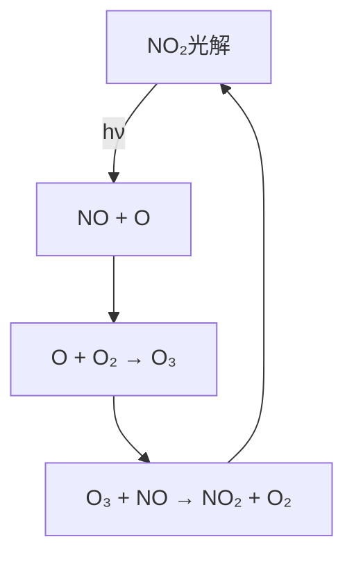

---
---

# 3 氮氧化物（NOₓ）的大气化学反应🌫️⚡

---

## **目录**
1. [NO的化学反应](#1.no的化学反应)
2. [NO₂的化学反应](#2.no₂的化学反应)
3. [HNO₂的化学反应](#3.hno₂的化学反应)
4. [NO、NO₂与O₃的光化学循环](#4.no-no₂与o₃的光化学循环)
5. [NO₃自由基的特殊作用](#5.no₃自由基的特殊作用)
6. [环境意义](#6.环境意义)

---

# 1. **NO的化学反应**
## **关键反应式与机理**
| **反应类型** | **反应式** | **说明** |
|--------------|------------|----------|
| **与O₃反应** | `NO + O₃ → NO₂ + O₂` | 快速消耗O₃，城市大气中O₃与NO负相关 |
| **氧化为NO₂** | `RO₂· + NO → RO· + NO₂` | 烃类存在时，过氧自由基（RO₂·）氧化NO |
| **与HO·结合** | `NO + HO· → HONO` | HONO光解生成HO·，白天重要自由基源 |
| **与NO₃反应** | `NO + NO₃ → 2NO₂` | 夜间控制NO₃浓度，防止其积累 |

---

# 2. **NO₂的化学反应**
## **光解与氧化**
| **反应类型** | **反应式** | **说明** |
|--------------|------------|----------|
| **光解反应** | `NO₂ + hν（λ≤420 nm）→ NO + O` | **O₃生成源头**：`O + O₂ + M → O₃ + M` |
| **与HO·反应** | `NO₂ + HO· → HNO₃` | 酸雨前体，硝酸盐气溶胶来源 |
| **与O₃反应** | `NO₂ + O₃ → NO₃ + O₂` | 生成NO₃自由基，夜间重要氧化剂 |
| **与NO₃反应** | `NO₂ + NO₃ ⇌ N₂O₅` | 温度敏感平衡，N₂O₅水解生成HNO₃ |

---

# 3. **HNO₂的化学反应**
## **光解与自由基生成**
| **反应式** | **条件/产物** | **环境作用** |
|------------|----------------|--------------|
| `HNO₂ + hν → HO· + NO` | λ≤420 nm | **白天自由基源**：HO·引发链反应 |
| `HNO₂ + HO· → H₂O + NO₂` | 气相反应 | 消耗HO·，生成NO₂ |

---

# 4. **NO、NO₂与O₃的光化学循环**
## **核心循环机制**

**动态平衡**：  
白天光照下，O₃浓度由NO₂/NO比例控制：  
`[O₃] = (k₁/k₃) × [NO₂]/[NO]`  
（k₁为NO₂光解速率，k₃为O₃与NO反应速率）

$$
\text{NO} + \text{O}_3 \rightarrow \text{NO}_2 + \text{O}_2 \quad (\text{控制O₃浓度})
$$
$$
\text{NO}_2 + h\nu \xrightarrow{\lambda \leq 420\ \text{nm}} \text{NO} + \text{O}
$$
$$
\text{O} + \text{O}_2 + M \rightarrow \text{O}_3 + M \quad (\text{对流层O₃来源})
$$

---

# 5. **NO₃自由基的特殊作用**
## **夜间大气化学的主角**
| **特性** | **反应** | **影响** |
|----------|----------|----------|
| **生成** | `NO₂ + O₃ → NO₃ + O₂` | 夜间NO₃浓度可达10⁸ molecules/cm³ |
| **光解** | `NO₃ + hν → NO + O₂` 或 `NO₂ + O` | 白天迅速分解，寿命仅数秒 |
| **与烯烃反应** | `NO₃ + 烯烃 → 硝酸酯 + 自由基` | 生成二次有机气溶胶（SOA） |
| **与VOCs反应** | `NO₃ + 异戊二烯 → 硝基氧有机化合物` | 影响区域空气质量 |

---

# 6. **环境意义**
## **氮氧化物与大气污染**
| **问题**    | **机制**                      | **实例**      |
| --------- | --------------------------- | ----------- |
| **光化学烟雾** | NO₂光解启动链反应，VOCs促进O₃积累       | 洛杉矶型烟雾（棕褐色） |
| **酸雨**    | `NO₂ → HNO₃`，`NO₃水解 → HNO₃` | 欧洲、中国西南酸雨区  |
| **臭氧层破坏** | 平流层NOₓ催化O₃分解（非极地）           | 超音速飞机排放影响   |
| **气溶胶生成** | NO₃与VOCs反应生成有机硝酸盐           | 加重PM₂.5污染   |

---

## **关键数据表**
| **物种** | **典型浓度（城市）** | **主要汇** |
|----------|----------------------|------------|
| NO       | 10-500 ppb           | 氧化为NO₂ |
| NO₂      | 10-200 ppb           | 生成HNO₃ |
| NO₃      | 夜间：1-100 ppt      | 光解/沉降 |

---

**总结**：氮氧化物（NOₓ）通过复杂的光化学循环和自由基反应，主导对流层臭氧生成、酸雨前体形成及二次气溶胶污染。控制NOₓ排放（如机动车尾气、工业源）是改善空气质量的关键措施。 🌍🔬

---
