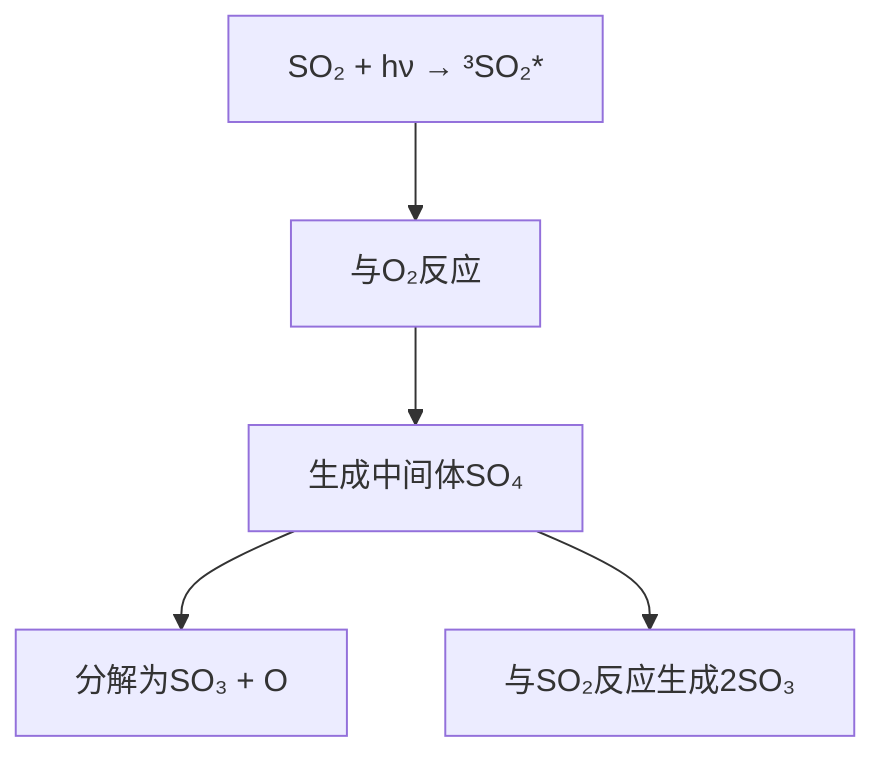
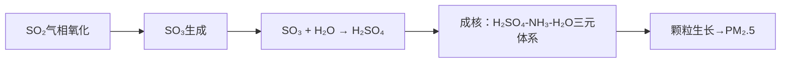

---
---

# 4 二氧化硫气相反应

---

## **目录**

1. [光吸收特性](#1-光吸收特性)
2. [直接光氧化](#2-直接光氧化)
3. [间接光氧化（自由基氧化）](#3-间接光氧化自由基氧化)
4. [环境效应与二次污染物](#4-环境效应与二次污染物)
5. [关键数据与总结](#5-关键数据与总结)

---

# 1. **光吸收特性**
## **SO₂的光谱吸收带**
| **波长范围** | **吸收强度** | **激发态** | **产物** |
|--------------|---------------|-------------|----------|
| 240–330 nm   | 强吸收        | 单线态（¹SO₂） | SO₂* → SO + O（极少发生） |
| 340–400 nm   | 弱吸收        | 三线态（³SO₂） | SO₂* → 参与氧化反应 |
| <240 nm      | 极强吸收      | 高能态       | 直接解离（对流层中无意义） |

**注**：SO₂键能（S=O）为545.1 kJ/mol，**无法被可见光直接解离**，仅生成激发态分子（SO₂*）。

---

# 2. **直接光氧化**
## **激发态SO₂的反应路径**

**关键反应式**：
- `³SO₂ + O₂ → SO₃ + O`  
- `SO₄ + SO₂ → 2SO₃`  
**产物**：SO₃进一步与水反应生成硫酸（H₂SO₄），形成**硫酸盐气溶胶**。

---

# 3. **间接光氧化（自由基氧化）**
## **自由基主导的氧化路径**
| **自由基类型** | **反应式** | **速率常数（cm³·molecule⁻¹·s⁻¹）** |
|----------------|------------|-----------------------------------|
| **羟基自由基（HO·）** | `SO₂ + HO· → HOSO₂·`   `HOSO₂· + O₂ → HO₂· + SO₃` | ~1.1×10⁻¹²（25°C） |
| **过氧自由基（RO₂·）** | `SO₂ + CH₃O₂· → CH₃O· + SO₃` | ~3×10⁻¹⁶（25°C） |
| **Criegee双自由基** | `SO₂ + CH₂OO· → SO₃ + HCHO` | 高效（>90%产率） |

**链式反应示例**：
1. **HO·引发**：  
   `HO· + SO₂ → HOSO₂·`  
   `HOSO₂· + O₂ → HO₂· + SO₃`  
2. **SO₃转化**：  
   `SO₃ + H₂O → H₂SO₄`（硫酸气溶胶核心反应）

---

# 4. **环境效应与二次污染物**
## **主要环境影响**
| **问题** | **机制** | **典型现象** |
|----------|----------|--------------|
| **酸雨** | `H₂SO₄ + H₂O → H⁺ + SO₄²⁻` | pH < 5.6的降水，腐蚀建筑/酸化土壤 |
| **气溶胶污染** | 硫酸盐气溶胶（PM₂.5） | 降低能见度（雾霾），影响气候（冷却效应） |
| **健康危害** | 呼吸道刺激 | 哮喘、慢性支气管炎 |

## **硫酸盐气溶胶形成路径**

---

# 5. **关键数据与总结**
## **大气中SO₂的转化速率**
| **氧化途径** | **贡献比例** | **典型半衰期** |
|--------------|---------------|-----------------|
| 直接光氧化   | <5%           | 数天至数周      |
| HO·自由基氧化 | ~80%          | 约1周（清洁大气）|
| 其他自由基氧化 | ~15%         | 依赖VOCs浓度    |

## **控制策略**
- **源头减排**：燃煤电厂脱硫（石灰石-石膏法）、机动车尾气净化。
- **区域协同**：跨国酸雨控制协议（如欧洲CLRTAP）。

---
