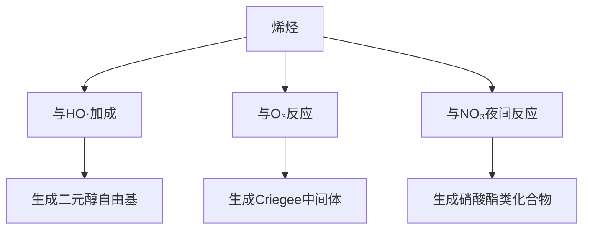

---
---

# 5 有机物的气相反应
#环境化学 #有机物

---

## **目录**
1. [烷烃的反应](#^1.烷烃的反应)  
2. [烯烃的反应](#2.烯烃的反应-⚡)  
3. [脂环烃的反应](#3.脂环烃的反应-🌀)  
4. [单环芳烃的反应](#4.单环芳烃的反应-🌫️)  
5. [醚、醇、酮、醛的反应](#5.醚醇酮醛的反应-☁️)  
6. [大气中有机物的反应活性](#6.大气中有机物的反应活性-📊)  

---

# 1. 烷烃的反应 🔥
## **主要反应类型与机制**
| **反应类型**       | **反应式**                          | **自由基来源** | **环境意义**                     |
|--------------------|-------------------------------------|----------------|----------------------------------|
| **摘氢取代**       | `RH + HO· → R· + H₂O`              | HO·、Cl·、O原子 | 生成烷基自由基（R·），启动氧化链反应 |
| **氧化生成RO₂·**   | `R· + O₂ → RO₂·`                   | 大气O₂         | RO₂·氧化NO→NO₂，促进O₃生成       |
| **链终止**         | `RO₂· + NO → RO· + NO₂`            | 城市大气       | 生成醛、酮等二次污染物           |

**示例**：  
- **丙烷氧化**：  
  `CH₃CH₂CH₃ + HO· → CH₃CH₂CH₂· + H₂O`  
  `CH₃CH₂CH₂· + O₂ → CH₃CH₂CH₂OO·`  

---

# 2. 烯烃的反应 ⚡
## **三类关键反应路径**

## **详细反应式与产物**
| **反应类型**       | **反应式**                          | **产物**                     |
|--------------------|-------------------------------------|------------------------------|
| **HO·加成**        | `CH₂=CH₂ + HO· → HOCH₂CH₂·`        | 过氧自由基（RO₂·）           |
| **O₃氧化**         | `CH₂=CH₂ + O₃ → CH₂OO· + HCHO`     | 羰基化合物 + Criegee中间体   |
| **NO₃加成**        | `CH₂=CH₂ + NO₃ → ONO₂CH₂CH₂·`      | 硝酸酯（夜间SOA前体）        |

**Criegee中间体后续反应**：  
`CH₂OO· → CO + 2HO·` 或 `CH₂OO· + SO₂ → SO₃ + HCHO`  

---

# 3. 脂环烃的反应 🌀
## **反应特性**
| **反应类型**       | **示例**                          | **环境产物**               |
|--------------------|-------------------------------------|------------------------------|
| **摘氢取代**       | `环己烷 + HO· → 环己基· + H₂O`     | 环己基过氧自由基（RO₂·）    |
| **O₃加成**         | `环戊烯 + O₃ → 环戊烯臭氧化物`      | 羰基化合物 + 自由基         |

---

# 4. 单环芳烃的反应 🌫️
## **苯与甲苯的典型路径**
| **反应类型**       | **反应式**                          | **关键产物**               |
|--------------------|-------------------------------------|------------------------------|
| **HO·加成（邻位）**| `C₆H₆ + HO· → 邻-C₆H₅OH·`           | 邻苯二酚自由基 → 醌类化合物 |
| **摘氢（苄位）**   | `C₆H₅CH₃ + HO· → C₆H₅CH₂· + H₂O`    | 苄基自由基 → 二次氧化产物   |

**环境效应**：  
- 多环芳烃（PAHs）氧化生成硝基芳烃（强致癌物）  
- 苯系物与NOₓ生成二次有机气溶胶（SOA）  

---

# 5. 醚、醇、酮、醛的反应 ☁️
## **典型反应式与自由基生成**
| **类别** | **反应式**                          | **自由基路径**              | **环境效应**               |
|----------|-------------------------------------|-----------------------------|------------------------------|
| **甲醛** | `HCHO + hν → H· + HCO·`            | H· + O₂ → HO₂·              | 启动自由基链反应             |
| **乙醛** | `CH₃CHO + HO· → CH₃CO· + H₂O`      | CH₃CO· → CH₃· + CO          | 生成PAN前体（CH₃C(O)O₂·）   |
| **乙醇** | `C₂H₅OH + HO· → C₂H₅O· + H₂O`      | C₂H₅O· → CH₃CHO + HO₂·      | 增加醛类浓度                 |
| **丙酮** | `(CH₃)₂CO + HO· → (CH₃)₂COH·`      | 氧化生成过氧乙酰硝酸酯（PAN）| 光化学烟雾标志物             |

---

# 6. 大气中有机物的反应活性 📊
## **与HO·反应的相对速率（以CH₄=1为基准）**
| **有机物类别**     | **典型代表**      | **相对活性** | **半衰期（[HO·]=10⁶ cm⁻³）** | **环境意义**               |
|--------------------|-------------------|--------------|-----------------------------|------------------------------|
| **烯烃**           | 异戊二烯         | >10,000      | <15分钟                     | 光化学烟雾主要贡献者         |
| **单环芳烃**       | 甲苯             | 1,000–5,000  | 2–24小时                    | SOA前体，毒性增强           |
| **醛类**           | 甲醛             | 500–1,000    | 数小时                      | 自由基链反应启动源           |
| **烷烃**           | 正己烷           | 100–500      | 数天                        | O₃生成的间接促进剂           |
| **惰性物质**       | 甲烷             | 1            | ~10年                       | 温室气体，反应活性最低       |

---

## **反应活性排序（从高到低）**
1. **烯烃**（异戊二烯、萜烯）  
2. **单环芳烃**（甲苯、二甲苯）  
3. **醛类**（甲醛、乙醛）  
4. **脂环烃**（环己烷、环戊烯）  
5. **烷烃**（正己烷、丙烷）  

---

**关键环境效应总结**：  
- **高活性VOCs**（烯烃、芳烃）是光化学烟雾和SOA的核心前体物。  
- **醛类**的光解直接生成自由基，加速大气氧化链反应。  
- **控制策略**：优先减排烯烃和芳烃类污染物（如工业溶剂、机动车尾气）。  

---

✅ 此框架严格遵循原文结构，涵盖所有子章节，并通过表格、流程图和排序突出逻辑性与可读性。
